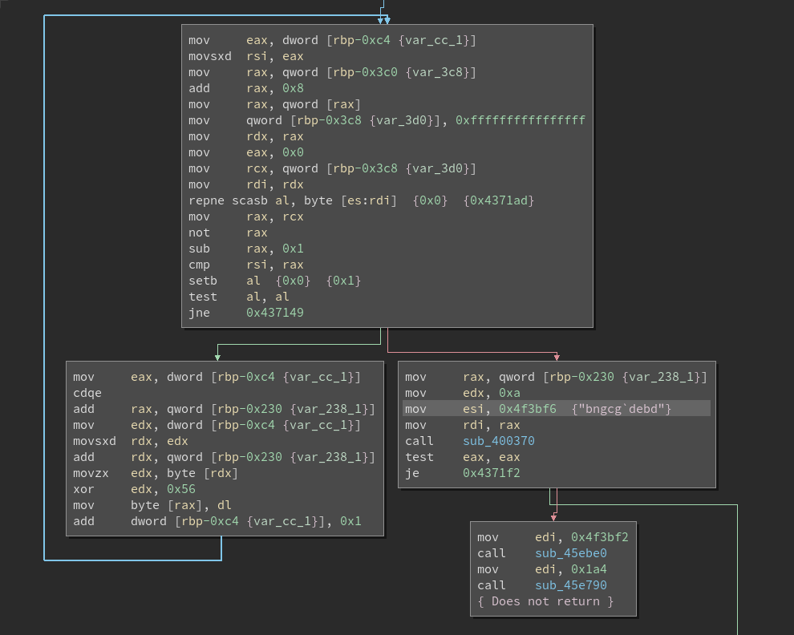
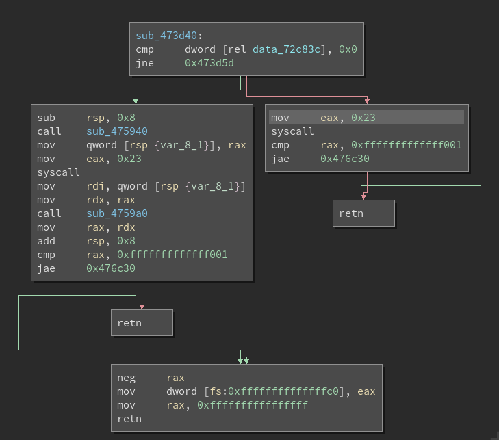

# 2014 Fire-Eye Flareon Challenge Six

## Special thanks
To Gassedelen for having a copy of this binary 4 years after the CTF!!!
And his post inspired this particular solve: http://gaasedelen.blogspot.com/2014/09/solving-fireeyes-flare-on-six-via-side.html

I will attempt to re-solve in a similar way without referencing back to what he did but use the same methodology of using instruction counts as a side channel attack. I hope to highlight some useful features of usercorn along the way.

## Let's start!

Run the binary to see what we can observe:
```
$ ~/usercorn/usercorn run -inscount ./e7bc5d2c0cf4480348f5504196561297
no
inscount: 56057
```
Let's start adding arguments and check counts
```
0: 56057
1: 274148
2: error
3: 314987
```

With 2 arguments we get:
```
$ ~/usercorn/usercorn run -inscount ./e7bc5d2c0cf4480348f5504196561297 1 2

+++ caught panic +++
Kernel not found for syscall 'ptrace'
```
This means the application is calling the ptrace syscall, which is not implemented. But this is a common anti-debug technique, so lets investigate.

We can add the `-trace` argument and check what parameters are being passed to ptrace.

```C
0x41f1fd: mov edx, 1                                         | rdx = 0x0000000000000001
0x41f202: mov esi, 0                                         | rsi = 0x0000000000000000
0x41f207: mov edi, 0                                         | rdi = 0x0000000000000000
0x41f20c: mov eax, 0                                         | rax = 0x0000000000000000
0x41f211: call 0x4742b0                                      | rsp = 0x00000000bfffe178 | W bfffe178
0x4742b0: lea rax, qword ptr [rsp + 8]                       | rax = 0x00000000bfffe180
W 0xbfffe178: 16f24100 00000000                              [..A.....            ] W
0x4742b5: mov qword ptr [rsp - 0x30], rsi                    |                          | W bfffe148
0x4742ba: mov qword ptr [rsp - 0x20], rcx                    |                          | W bfffe158
0x4742bf: mov dword ptr [rsp - 0x68], 0x18                   |                          | W bfffe110
0x4742c7: mov qword ptr [rsp - 0x28], rdx                    |                          | W bfffe150
0x4742cc: mov r8d, edi                                       |
0x4742cf: mov qword ptr [rsp - 0x60], rax                    |                          | W bfffe118
0x4742d4: lea rax, qword ptr [rsp - 0x38]                    | rax = 0x00000000bfffe140
0x4742d9: lea ecx, dword ptr [r8 - 1]                        | rcx = 0x00000000ffffffff
0x4742dd: lea r10, qword ptr [rsp - 0x48]                    | r10 = 0x00000000bfffe130
0x4742e2: movsxd rsi, dword ptr [rsp - 0x30]                 |                          | R bfffe148
0x4742e7: mov edi, edi                                       |
0x4742e9: mov qword ptr [rsp - 0x58], rax                    |                          | W bfffe120
0x4742ee: mov eax, 0x10                                      | rax = 0x0000000000000010
0x4742f3: add rax, qword ptr [rsp - 0x58]                    | rax = 0x00000000bfffe150 | R bfffe120
0x4742f8: mov rdx, qword ptr [rax]                           |                          | R bfffe150
0x4742fb: mov eax, 0x18                                      | rax = 0x0000000000000018
0x474300: add rax, qword ptr [rsp - 0x58]                    | rax = 0x00000000bfffe158 | R bfffe120
0x474305: mov dword ptr [rsp - 0x68], 0x20                   |                          | W bfffe110
0x47430d: cmp ecx, 2                                         |
0x474310: cmova r10, qword ptr [rax]                         | r10 = 0x0000000000000000 | R bfffe158
0x474314: mov eax, 0x65                                      | rax = 0x0000000000000065
0x474319: syscall                                            |
W 0xbfffe148: 00000000 00000000 01000000 00000000            [................    ] W
W 0xbfffe158: 00000000 00000000                              [........            ] W
W 0xbfffe110: 18000000                                       [....                ] W
W 0xbfffe118: 80e1ffbf 00000000 40e1ffbf 00000000            [........@.......    ] W
R 0xbfffe148: 00000000                                       [....                ] R
R 0xbfffe120: 40e1ffbf 00000000                              [@.......            ] R
R 0xbfffe150: 01000000 00000000 00000000 00000000            [................    ] R
R 0xbfffe120: 40e1ffbf 00000000                              [@.......            ] R
W 0xbfffe110: 20000000                                       [ ...                ] W

+++ caught panic +++
Kernel not found for syscall 'ptrace'
```
Definition of the syscall:
```C
#               : 101
Name            : ptrace
rax             : 0x65
rdi             : long request
rsi             : long pid
rdx             : unsigned long addr
rcx             : unsigned long data
r8              : -
r9              : -
Definition      : kernel/ptrace.c
```
Looks like a pretty typical `if (ptrace(PTRACE_TRACEME, 0, 1, 0) == -1)`

So let's create a patch to NOP the call and proceed:
[1-patch_ptrace.usrcrn](1-patch_ptrace.usrcrn)

Here I've implemented two different ways of getting around this syscall.
```lua
on code 0x474319 do
  rax = 0
  rip = 0x474346
end
```
or, I can simply patch the binary
```lua
patch 0x474319 'nop'
patch 0x474320 'nop'
patch 0x474321 'jmp 0x474346'
```
Additionally, you can also call usercorn with `-stubsys` to ignore unimplemented syscalls.
I decided to go with the first `on code xxxx do` method, because I didn't want to hide any other syscalls that may be missing.
```
$ ~/usercorn/usercorn run -inscount -ex 1-patch_ptrace.usrcrn ./e7bc5d2c0cf4480348f5504196561297 1 2                                            
bad
inscount: 433710
```
Great, making progress. Seems like 2 arguments and we need to figure out number of characters.
[Link](2-determin_length.py)
```
/home/code/usercorn/usercorn run -inscount -ex 1-patch_ptrace.usrcrn ./e7bc5d2c0cf4480348f5504196561297 111111111 A
Chars in first arg: 9
inscount: 433536
--------------------------------------------------------------------------------
/home/code/usercorn/usercorn run -inscount -ex 1-patch_ptrace.usrcrn ./e7bc5d2c0cf4480348f5504196561297 1111111111 A
Chars in first arg: 10
inscount: 434230
--------------------------------------------------------------------------------
/home/code/usercorn/usercorn run -inscount -ex 1-patch_ptrace.usrcrn ./e7bc5d2c0cf4480348f5504196561297 11111111111 A
Chars in first arg: 11
inscount: 433538
```
So it looks like 10 characters in the first argument is our outlier. Lets check the second argument.
[Link](./3-determine_length2.py)

Doesn't look like that makes much difference at the moment. Lets pick something substancial and proceed.
[Link](./4-determine_arg1.py)

Mmmm, I'm not getting any difference in counts. Lets see if we can spot a difference between two traces:
`/home/code/usercorn/usercorn run -trace -inscount -ex 1-patch_ptrace.usrcrn ./e7bc5d2c0cf4480348f5504196561297 1AAAAAAAAA AAAAAAAAAAAAAAAAAAAA &> trace_char1.out`
`/home/code/usercorn/usercorn run -trace -inscount -ex 1-patch_ptrace.usrcrn ./e7bc5d2c0cf4480348f5504196561297 2AAAAAAAAA AAAAAAAAAAAAAAAAAAAA &> trace_char2.out`

```C
$ diff trace_char1.out trace_char2.out
1271c1271
< 0x45dde1: mov rax, qword ptr [rax]                           | rax = 0x412f22e7193899cb | R bffffff0
---
> 0x45dde1: mov rax, qword ptr [rax]                           | rax = 0x339531cbf63238f6 | R bffffff0
1274c1274
< 0x45dde4: xor al, al                                         | rax = 0x412f22e719389900
---
> 0x45dde4: xor al, al                                         | rax = 0x339531cbf6323800
1280,1281c1280,1281
< W 0xbffff050: 00993819 e7222f41                              [..8.."/A            ] W
< W 0x0072d8a8: 00993819 e7222f41                              [..8.."/A            ] W
---
> W 0xbffff050: 003832f6 cb319533                              [.82..1.3            ] W
> W 0x0072d8a8: 003832f6 cb319533                              [.82..1.3            ] W
1342,1344c1342,1344
< 0x476308: rdtsc                                              | rax = 0x0000000030e0204e
<                                                              + rdx = 0x000000000021950d
< 0x47630a: shl rdx, 0x20                                      | rdx = 0x0021950d00000000
---
> 0x476308: rdtsc                                              | rax = 0x000000002c354408
>                                                              + rdx = 0x0000000000219502
> 0x47630a: shl rdx, 0x20                                      | rdx = 0x0021950200000000
1346c1346
< 0x476310: or rdx, rax                                        | rdx = 0x0021950d30e0204e
---
> 0x476310: or rdx, rax                                        | rdx = 0x002195022c354408
1353c1353
< W 0x0072c888: 4e20e030 0d952100                              [N .0..!.            ] W
---
> W 0x0072c888: 0844352c 02952100                              [.D5,..!.            ] W
642531c642531
< 0x46a24e: movzx ecx, byte ptr [rsi]                          | rcx = 0x0000000000000031 | R bffff2bc
---
> 0x46a24e: movzx ecx, byte ptr [rsi]                          | rcx = 0x0000000000000032 | R bffff2bc
642539c642539
< W 0x0072f6b0: 31                                             [1                   ] W
---
> W 0x0072f6b0: 32                                             [2                   ] W
642595,642596c642595,642596
< 0x437168: movzx edx, byte ptr [rdx]                          | rdx = 0x0000000000000031 | R 72f6b0
< 0x43716b: xor edx, 0x56                                      | rdx = 0x0000000000000067
---
> 0x437168: movzx edx, byte ptr [rdx]                          | rdx = 0x0000000000000032 | R 72f6b0
> 0x43716b: xor edx, 0x56                                      | rdx = 0x0000000000000064
642615,642616c642615,642616
< R 0x0072f6b0: 67                                             [g                   ] R
< W 0x0072f6b0: 67                                             [g                   ] W
---
> R 0x0072f6b0: 64                                             [d                   ] R
> W 0x0072f6b0: 64                                             [d                   ] W
643029c643029
< 0x46b992: mov rax, qword ptr [rdi - 0xa]                     | rax = 0x1717171717171767 | R 72f6b0
---
> 0x46b992: mov rax, qword ptr [rdi - 0xa]                     | rax = 0x1717171717171764 | R 72f6b0
643035c643035
< R 0x0072f6b0: 67171717 17171717                              [g.......            ] R
---
> R 0x0072f6b0: 64171717 17171717                              [d.......            ] R
643042c643042
< 0x46c280: and eax, 0xff                                      | rax = 0x0000000000000067
---
> 0x46c280: and eax, 0xff                                      | rax = 0x0000000000000064
643044c643044
< 0x46c28b: sub eax, ecx                                       | rax = 0x0000000000000005
---
> 0x46c28b: sub eax, ecx                                       | rax = 0x0000000000000002
```
A couple of things that I noticed

1 - `rdtsc` is being used. Probably another anti-debug mechanism being utilized. Not sure that matters here though since we're probably fast enough.

2 - `0x46a24e: movzx ecx, byte ptr [rsi]` seems to be where our input is being consumed.

3 - `0x43716b: xor edx, 0x56` is interesting... Lets open up our _favorite affordable disassembler_ BinaryNinja



Seems like a cool little loop happening, the loop exits at `0x4371bf`.
We can investigate register states using the traces we already took.
It looks like the loop takes values at `rbp-0xc4 + rbp-0x230` and xors by 0x56. We can see `rbp-0x230` is being passed to a function along with the address `0x4f3bf6` which has the string "bngcg\`debd".

Lets see if we just xor that..
```python
>>> import sys
>>> for c in "bngcg`debd":
...   sys.stdout.write(chr(ord(c)^0x56))
...
4815162342>>>
```

So we're betting that is the first argument.

Let's check what we get:
`$ /home/code/usercorn/usercorn run -inscount -ex 1-patch_ptrace.usrcrn ./e7bc5d2c0cf4480348f5504196561297 4815162342 AAAAAAAAAAAAAAAAAAAA`


This doesn't seem to return, I waited a good 30 seconds before canceling it.

Sanity check, change last character of the first argument and check again.
```
$ /home/code/usercorn/usercorn run -inscount -ex 1-patch_ptrace.usrcrn ./e7bc5d2c0cf4480348f5504196561297 481516234A AAAAAAAAAAAAAAAAAAAA
bad
inscount: 434372
```

So we're on to something!. Just running the application straight also takes a long time and doesn't return... What's going on? Let's trace it:
`$ /home/code/usercorn/usercorn run -trace -ex 1-patch_ptrace.usrcrn ./e7bc5d2c0cf4480348f5504196561297 4815162342 AAAAAAAAAAAAAAAAAAAA`

This is how the trace ends:
```C
0x47c9c8: ret                                                | rsp = 0x00000000bfffe190 | R bfffe188                                                                                              
R 0xbfffe188: dc3b4700 00000000                              [.;G.....            ] R                                                                                                             
0x473bdc: test eax, eax                                      |                                                                                                                                    
0x473bde: je 0x473c08                                        |                                                                                                                                    
0x473c08: mov rax, qword ptr [rsp + 0x120]                   | rax = 0x00000000bfffe350 | R bfffe2b0                                                                                              
0x473c10: and eax, 0x10000                                   | rax = 0x0000000000010000                                                                                                           
0x473c15: jne 0x473c5c                                       |                                                                                                                                    
0x473c5c: lea rsi, qword ptr [rsp + 0x1a0]                   | rsi = 0x00000000bfffe330
R 0xbfffe2b0: 50e3ffbf 00000000                              [P.......            ] R
0x473c64: mov rdi, rsi                                       | rdi = 0x00000000bfffe330
0x473c67: call 0x473d40                                      | rsp = 0x00000000bfffe188 | W bfffe188
0x473d40: cmp dword ptr [rip + 0x2b8af5], 0                  |                          | R 72c83c
W 0xbfffe188: 6c3c4700 00000000                              [l<G.....            ] W
0x473d47: jne 0x473d5d                                       |
0x473d49: mov eax, 0x23                                      | rax = 0x0000000000000023
R 0x0072c83c: 00000000                                       [....                ] R
```



Looks like we're stuck in a syscall 0x23
```
#               : 35
Name            : nanosleep
rax             : 0x23
rdi             : struct timespec *rqtp
rsi             : struct timespec *rmtp
```
So we're sleeping for a long time. Lets fix that by telling usercorn to just ignore that:
```lua
on sys_pre 'nanosleep' do
  print 'Trying to sleep... NO WAY! Wake up sleepyhead!'
  return true
end
```
Add this to the previous patches we did... [Link](5-patch_ptrace_sleep.usrcrn)

Nice:
```
$ /home/code/usercorn/usercorn run -inscount -ex 5-patch_ptrace_sleep.usrcrn ./e7bc5d2c0cf4480348f5504196561297 4815162342 AAAAAAAAAAAAAAAAAAAA
Trying to sleep... NO WAY! Wake up sleepyhead!
Trying to sleep... NO WAY! Wake up sleepyhead!
Trying to sleep... NO WAY! Wake up sleepyhead!
Trying to sleep... NO WAY! Wake up sleepyhead!
Trying to sleep... NO WAY! Wake up sleepyhead!
inscount: 1229567
```
OK, time to try to bruteforce that second argument:
[Link](6-determine_arg2.py)

And there we have it... got the flag!:
`l1nhax.hurt.u5.a1l@flare-on.com`


# Alternative Route:
Now... I want to see if I can solve it without the instruction counts.
Let's do the trick with two traces and running a diff again.
```
$ /home/code/usercorn/usercorn run -trace -ex 5-patch_ptrace_sleep.usrcrn ./e7bc5d2c0cf4480348f5504196561297 4815162342 1AAAAAAAAAAAAAAAAAAA &> trace_1.out
$ /home/code/usercorn/usercorn run -trace -ex 5-patch_ptrace_sleep.usrcrn ./e7bc5d2c0cf4480348f5504196561297 4815162342 2AAAAAAAAAAAAAAAAAAA &> trace_2.out
```
```C
< 0x476308: rdtsc                                              | rax = 0x00000000fdd3c3cd
<                                                              + rdx = 0x000000000021ad9b
< 0x47630a: shl rdx, 0x20                                      | rdx = 0x0021ad9b00000000
---
> 0x476308: rdtsc                                              | rax = 0x000000004e356d04
>                                                              + rdx = 0x000000000021ada8
> 0x47630a: shl rdx, 0x20                                      | rdx = 0x0021ada800000000
1346c1346
< 0x476310: or rdx, rax                                        | rdx = 0x0021ad9bfdd3c3cd
---
> 0x476310: or rdx, rax                                        | rdx = 0x0021ada84e356d04
1353c1353
< W 0x0072c888: cdc3d3fd 9bad2100                              [......!.            ] W
---
> W 0x0072c888: 046d354e a8ad2100                              [.m5N..!.            ] W
1810293,1810295c1810293,1810295
< R 0xbffff2a7: 4c                                             [L                   ] R
< W 0xbffff2a7: 4c                                             [L                   ] W
< R 0xbffff2a7: 4c                                             [L                   ] R
---
> R 0xbffff2a7: 8c                                             [.                   ] R
> W 0xbffff2a7: 8c                                             [.                   ] W
> R 0xbffff2a7: 8c      
```
What is interesting here is that the address `0xbfff....` Lets find the jump to it...
```C
0x44bb28: mov rdi, rax                                       | rdi = 0x00000000bffff2a7
0x44bb2b: call rdx                                           | rsp = 0x00000000bfffdd88 | W bfffdd88
0xbfffdda0: mov rax, rdi                                     |
R 0xbfffdd90: a8f0ffbf 00000000                              [........            ] R
R 0xbffff0b8: 00000000 00000000                              [........            ] R
W 0xbfffdd88: 2dbb4400 00000000    
```
So `0x44bb2b` makes the call to it. Lets see where else this memory address is used:
```C
$ grep 0xbfffdda0 trace_2.out
W 0xbfffdda0: [skipped 0x3e8 null bytes] W
W 0xbfffdda0: 4889f8                                         [H..                 ] W
0xbfffdda0: mov rax, rdi                                     |                         
```
This looks like some code is being copied into a memory mapped area so that it's harder to analyze...

I want a usercorn script to dump that memory for me... wait, actually just give me the disassembly:
```lua
on code 0x44bb2b do
  dis(0xbfffdda0, 0x3e8)
end
```
And this gives me:
```C
0xbfffdda0: mov rax, rdi
0xbfffdda3: call 0xbfffdda8
0xbfffdda8: mov rbx, qword ptr [rsp]
0xbfffddac: add rbx, 0xa
0xbfffddb0: jmp 0xbfffddbc
0xbfffddb2: xor rdx, rdx
0xbfffddb5: xor rax, rax
0xbfffddb8: mov al, 0x3c
0xbfffddba: syscall
0xbfffddbc: ror byte ptr [rax], 0xf2
0xbfffddbf: cmp byte ptr [rax], 0x1b
0xbfffddc2: je 0xbfffddc6
0xbfffddc4: jmp rbx
0xbfffddc6: add rax, 1
0xbfffddca: xor byte ptr [rax], 0x40
0xbfffddcd: xor byte ptr [rax], 0xf2
0xbfffddd0: xor byte ptr [rax], 0xb3
0xbfffddd3: cmp byte ptr [rax], 0x30
0xbfffddd6: je 0xbfffddda
0xbfffddd8: jmp rbx
0xbfffddda: add rax, 1
0xbfffddde: xor byte ptr [rax], 0x71
0xbfffdde1: cmp byte ptr [rax], 0x1f
0xbfffdde4: je 0xbfffdde8
0xbfffdde6: jmp rbx
0xbfffdde8: add rax, 1
0xbfffddec: add byte ptr [rax], 0xa3
0xbfffddef: ror byte ptr [rax], 0xbc
0xbfffddf2: cmp byte ptr [rax], 0xb0
0xbfffddf5: je 0xbfffddf9
0xbfffddf7: jmp rbx
0xbfffddf9: add rax, 1
0xbfffddfd: sub byte ptr [rax], 0x79
0xbfffde00: cmp byte ptr [rax], 0xe8
0xbfffde03: je 0xbfffde07
0xbfffde05: jmp rbx
0xbfffde07: add rax, 1
0xbfffde0b: ror byte ptr [rax], 0x82
0xbfffde0e: sub byte ptr [rax], 0x28
0xbfffde11: cmp byte ptr [rax], 0xf6
0xbfffde14: je 0xbfffde18
0xbfffde16: jmp rbx
0xbfffde18: add rax, 1
0xbfffde1c: sub byte ptr [rax], 0xb0
0xbfffde1f: ror byte ptr [rax], 0x4d
0xbfffde22: add byte ptr [rax], 0x2c
0xbfffde25: cmp byte ptr [rax], 0x1f
0xbfffde28: je 0xbfffde2c
0xbfffde2a: jmp rbx
0xbfffde2c: add rax, 1
0xbfffde30: add byte ptr [rax], 0x54
0xbfffde33: rol byte ptr [rax], 0x99
0xbfffde36: xor byte ptr [rax], 0xb8
0xbfffde39: ror byte ptr [rax], 0x2a
0xbfffde3c: add byte ptr [rax], 0x3f
0xbfffde3f: cmp byte ptr [rax], 0xaf
0xbfffde42: je 0xbfffde46
0xbfffde44: jmp rbx
0xbfffde46: add rax, 1
0xbfffde4a: ror byte ptr [rax], 0xba
0xbfffde4d: cmp byte ptr [rax], 0x5d
0xbfffde50: je 0xbfffde54
0xbfffde52: jmp rbx
0xbfffde54: add rax, 1
0xbfffde58: xor byte ptr [rax], 0xed
0xbfffde5b: ror byte ptr [rax], 0x6c
0xbfffde5e: add byte ptr [rax], 0x30
0xbfffde61: cmp byte ptr [rax], 0x29
0xbfffde64: je 0xbfffde68
0xbfffde66: jmp rbx
0xbfffde68: add rax, 1
0xbfffde6c: sub byte ptr [rax], 0xbf
0xbfffde6f: cmp byte ptr [rax], 0xb5
0xbfffde72: je 0xbfffde76
0xbfffde74: jmp rbx
0xbfffde76: add rax, 1
0xbfffde7a: rol byte ptr [rax], 0xbc
0xbfffde7d: add byte ptr [rax], 0x8c
0xbfffde80: rol byte ptr [rax], 0x7b
0xbfffde83: sub byte ptr [rax], 0x31
0xbfffde86: add byte ptr [rax], 0x63
0xbfffde89: cmp byte ptr [rax], 0xa5
0xbfffde8c: je 0xbfffde90
0xbfffde8e: jmp rbx
0xbfffde90: add rax, 1
0xbfffde94: rol byte ptr [rax], 0x20
0xbfffde97: rol byte ptr [rax], 0x16
0xbfffde9a: xor byte ptr [rax], 0xae
0xbfffde9d: rol byte ptr [rax], 0x98
0xbfffdea0: cmp byte ptr [rax], 0xf3
0xbfffdea3: je 0xbfffdea7
0xbfffdea5: jmp rbx
0xbfffdea7: add rax, 1
0xbfffdeab: ror byte ptr [rax], 0x6e
0xbfffdeae: add byte ptr [rax], 0xd2
0xbfffdeb1: cmp byte ptr [rax], 0xa6
0xbfffdeb4: je 0xbfffdeb8
0xbfffdeb6: jmp rbx
0xbfffdeb8: add rax, 1
0xbfffdebc: add byte ptr [rax], 0x34
0xbfffdebf: cmp byte ptr [rax], 0x62
0xbfffdec2: je 0xbfffdec6
0xbfffdec4: jmp rbx
0xbfffdec6: add rax, 1
0xbfffdeca: add byte ptr [rax], 0xcd
0xbfffdecd: sub byte ptr [rax], 0x10
0xbfffded0: add byte ptr [rax], 0x62
0xbfffded3: xor byte ptr [rax], 0xb2
0xbfffded6: cmp byte ptr [rax], 0x32
0xbfffded9: je 0xbfffdedd
0xbfffdedb: jmp rbx
0xbfffdedd: add rax, 1
0xbfffdee1: xor byte ptr [rax], 0xb7
0xbfffdee4: xor byte ptr [rax], 0x73
0xbfffdee7: ror byte ptr [rax], 7
0xbfffdeea: cmp byte ptr [rax], 0xeb
0xbfffdeed: je 0xbfffdef1
0xbfffdeef: jmp rbx
0xbfffdef1: add rax, 1
0xbfffdef5: add byte ptr [rax], 0x34
0xbfffdef8: sub byte ptr [rax], 0x61
0xbfffdefb: ror byte ptr [rax], 0x36
0xbfffdefe: add byte ptr [rax], 0x5b
0xbfffdf01: sub byte ptr [rax], 0x4c
0xbfffdf04: cmp byte ptr [rax], 0xb
0xbfffdf07: je 0xbfffdf0b
0xbfffdf09: jmp rbx
0xbfffdf0b: add rax, 1
0xbfffdf0f: add byte ptr [rax], 0x5a
0xbfffdf12: cmp byte ptr [rax], 0x9a
0xbfffdf15: je 0xbfffdf19
0xbfffdf17: jmp rbx
0xbfffdf19: add rax, 1
0xbfffdf1d: ror byte ptr [rax], 0xa2
0xbfffdf20: cmp byte ptr [rax], 0x99
0xbfffdf23: je 0xbfffdf27
0xbfffdf25: jmp rbx
0xbfffdf27: add rax, 1
0xbfffdf2b: xor byte ptr [rax], 0x7e
0xbfffdf2e: sub byte ptr [rax], 0xe7
0xbfffdf31: cmp byte ptr [rax], 0x2b
0xbfffdf34: je 0xbfffdf38
0xbfffdf36: jmp rbx
0xbfffdf38: add rax, 1
0xbfffdf3c: sub byte ptr [rax], 0xb8
0xbfffdf3f: xor byte ptr [rax], 0x86
0xbfffdf42: add byte ptr [rax], 0x4e
0xbfffdf45: ror byte ptr [rax], 0x4a
0xbfffdf48: rol byte ptr [rax], 0x57
0xbfffdf4b: cmp byte ptr [rax], 0xaf
0xbfffdf4e: je 0xbfffdf52
0xbfffdf50: jmp rbx
0xbfffdf52: add rax, 1
0xbfffdf56: ror byte ptr [rax], 0x86
0xbfffdf59: xor byte ptr [rax], 0xe8
0xbfffdf5c: rol byte ptr [rax], 0x95
0xbfffdf5f: xor byte ptr [rax], 0x4a
0xbfffdf62: xor byte ptr [rax], 0xad
0xbfffdf65: cmp byte ptr [rax], 0xc3
0xbfffdf68: je 0xbfffdf6c
0xbfffdf6a: jmp rbx
0xbfffdf6c: add rax, 1
0xbfffdf70: ror byte ptr [rax], 0x45
0xbfffdf73: xor byte ptr [rax], 0xcc
0xbfffdf76: add byte ptr [rax], 0x1c
0xbfffdf79: cmp byte ptr [rax], 3
0xbfffdf7c: je 0xbfffdf80
0xbfffdf7e: jmp rbx
0xbfffdf80: add rax, 1
0xbfffdf84: sub byte ptr [rax], 0x4a
0xbfffdf87: cmp byte ptr [rax], 0xe3
0xbfffdf8a: je 0xbfffdf8e
0xbfffdf8c: jmp rbx
0xbfffdf8e: add rax, 1
0xbfffdf92: xor byte ptr [rax], 0xa5
0xbfffdf95: ror byte ptr [rax], 0x90
0xbfffdf98: cmp byte ptr [rax], 0xca
0xbfffdf9b: je 0xbfffdf9f
0xbfffdf9d: jmp rbx
0xbfffdf9f: add rax, 1
0xbfffdfa3: ror byte ptr [rax], 0xde
0xbfffdfa6: rol byte ptr [rax], 0x36
0xbfffdfa9: xor byte ptr [rax], 0x78
0xbfffdfac: sub byte ptr [rax], 0xd8
0xbfffdfaf: cmp byte ptr [rax], 0x3e
0xbfffdfb2: je 0xbfffdfb6
0xbfffdfb4: jmp rbx
0xbfffdfb6: add rax, 1
0xbfffdfba: add byte ptr [rax], 0xb5
0xbfffdfbd: sub byte ptr [rax], 0xad
0xbfffdfc0: ror byte ptr [rax], 0x89
0xbfffdfc3: rol byte ptr [rax], 0xa2
0xbfffdfc6: rol byte ptr [rax], 0x11
0xbfffdfc9: cmp byte ptr [rax], 0xd8
0xbfffdfcc: je 0xbfffdfd0
0xbfffdfce: jmp rbx
0xbfffdfd0: add rax, 1
0xbfffdfd4: add byte ptr [rax], 0x40
0xbfffdfd7: sub byte ptr [rax], 0x21
0xbfffdfda: ror byte ptr [rax], 0xc0
0xbfffdfdd: cmp byte ptr [rax], 0x82
0xbfffdfe0: je 0xbfffdfe4
0xbfffdfe2: jmp rbx
0xbfffdfe4: add rax, 1
0xbfffdfe8: rol byte ptr [rax], 0xe3
0xbfffdfeb: cmp byte ptr [rax], 0x7b
0xbfffdfee: je 0xbfffdff2
0xbfffdff0: jmp rbx
0xbfffdff2: add rax, 1
0xbfffdff6: sub byte ptr [rax], 0x78
0xbfffdff9: ror byte ptr [rax], 0xf6
0xbfffdffc: cmp byte ptr [rax], 0xd7
0xbfffdfff: je 0xbfffe003
0xbfffe001: jmp rbx
0xbfffe003: add rax, 1
0xbfffe007: xor rax, rax
0xbfffe00a: xor rdi, rdi
0xbfffe00d: xor rsi, rsi
0xbfffe010: xor rdx, rdx
0xbfffe013: xor r8, r8
0xbfffe016: push 2
0xbfffe018: pop rdi
0xbfffe019: push 1
0xbfffe01b: pop rsi
0xbfffe01c: push 6
0xbfffe01e: pop rdx
0xbfffe01f: push 0x29
0xbfffe021: pop rax
0xbfffe022: syscall
```

So there you have it, you can now convert it character by character
EG:
```python
0xbfffddca: xor byte ptr [rax], 0x40
0xbfffddcd: xor byte ptr [rax], 0xf2
0xbfffddd0: xor byte ptr [rax], 0xb3
0xbfffddd3: cmp byte ptr [rax], 0x30
0xbfffddd6: je 0xbfffddda
```
would be: `chr(0x40^0xf2^0xb3^0x30) = '1'`

We can take this a step further and implement this logic inside the usecorn script!

When we reach the code in question, grab the disassembly from the address in `rbx`.

```lua
on code 0x44bb2b do
  -- rdx is the mem location holding decipher asm. This could differ
  -- depending on the length of our argv[2]
  -- step through and find the first syscall, our decipher starts after that.
  arr = u.dis(rdx, 0x300)
  for idx,inst in pairs(arr) do
    if 'syscall' == inst['name'] then
      found_char = analyze_and_invert_next_chunk( arr[idx+1]['addr'] )
      -- Add the character we found to the flag string
      flag = flag .. found_char
      break
    end
  end
  ...
  ...
  ...
```

Then implement some logic to reverse the order of the instructions, and calculate the expected values:
```lua
func analyze_and_invert_next_chunk(start_addr)
  arr = u.dis(start_addr, 0x120)
  last_idx = find_chunk_end_addr(arr)
  calc_byte = 0

  -- Implement local interpreter for the asm
  -- Work backwards
  for i = last_idx, 1, -1 do
    data_byte = arr[i]['ops'][2]

    --print arr[i]
    if 'cmp' == arr[i]['name'] then
      calc_byte = data_byte
    elif 'ror' == arr[i]['name'] then
      shift_by = data_byte % 8
      calc_byte = rol_byte(calc_byte, shift_by)
    elif 'rol' == arr[i]['name'] then
      shift_by = data_byte % 8
      calc_byte = ror_byte(calc_byte, shift_by)
    elif 'xor' == arr[i]['name'] then
      calc_byte = calc_byte ^ data_byte
    elif 'sub' == arr[i]['name'] then
      calc_byte = (calc_byte + data_byte) & 0xff
    elif 'add' == arr[i]['name'] then
      if calc_byte < data_byte then
        calc_byte = calc_byte + 0x100
      end
      calc_byte = calc_byte-data_byte
    end

  end
  return chr(calc_byte)
end
```

For those interested in the full script, [It's Here](8-full_solve.usrcrn).
Now run it, and have it print the flag.
```
$ ~/usercorn/usercorn run -ex 8-full_solve.usrcrn e7bc5d2c0cf4480348f5504196561297 4815162342 AAAAAAAAAAAAAAAAAAAAAAAAAAAAAA
Trying to sleep... NO WAY! Wake up sleepyhead!
Trying to sleep... NO WAY! Wake up sleepyhead!
Trying to sleep... NO WAY! Wake up sleepyhead!
Trying to sleep... NO WAY! Wake up sleepyhead!
Trying to sleep... NO WAY! Wake up sleepyhead!
FLAG: l1nhax.hurt.u5.a1l@flare-on.com
```

I hope this highlights how versatile, powerful and useful the usercorn tool is.
