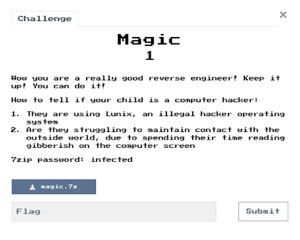

#  Flare-on Challenge 6 - Magic

This was the first year I actively participated in Flare-On instead of trying challenges after the it was over. Challenges 1-5 were interesting but were not Linux related, so it really forced me out of my comfort zone. Then on challenge #6 we finally had a Linux application to reverse.


## TLDR;

The binary provided asks for 666 passwords. The binary decodes the functions that it uses for password validation into memory before executing it, there are 33 calls per password, each function validates 1-3 characters somewhere in the password. Each correct password causes the binary to read itself into memory, randomize certain locations, and then write itself back out and overwrites itself. The next time these functions are decoded to different memory locations and run in a different order.

I ended up using three brute force methods to retrieve each password:

* Generic brute force that uses instruction count to determine correct characters
* Two special cases for 2 particular functions where this didn't work for lengths > 1 character
  * One function uses all of the characters in the user input and xors them several times to create a checksum that is then compared against a known value. I wasn't able to figure out a way to isolate individual characters, so I tested all combinations of possible passwords till the correct one was found.
  * The other function needed some more specific checks to find each character

There were many interesting challenges to get this accomplished, constantly changing function addresses, binaries modifying and overwriting themselves, 7 different functions for validation etc.

My implementation found a password approximately every 8 seconds using a single core, and retrieved the flag in 91mins.

## Tools: Usercorn

I used [`usercorn`](https://usercorn.party/) to analyze the binary and used its 'luaish' interface to find all the passwords. Usercorn is the creation of [lunixbochs](https://www.patreon.com/lunixbochs). This powerful tool is open source, can run arbitrary binaries on different host kernels, records and logs full system state at every instruction and much more. My hope is that this writeup highlights some of its capabilities, and that you as a reader are prompted to start using it. For more examples please visit: [usercorn_examples](https://github.com/Caesurus/usercorn_examples)

## Detailed Story Mode:

I want to clearly state that this whole process took me a week of working on it in the evenings. It's easy to read a write-up and think it was accomplished in a couple of hours. Especially for people who are getting started with reverse engineering challenges, you will get discouraged, but don't give up. There are many many dead ends, and you may have to throw away a bunch of work in order to attack it from a different direction. It wasn't a waste though, you learned how not to do something and that's still very valuable.

With that said, this is going to be a long one.
### Description


### Running the application:
```
$ ./magic
Welcome to the ever changing magic mushroom!
666 trials lie ahead of you!
Challenge 1/666. Enter key: AAA
No soup for you!
```

I want to spare you, the reader, too much of the step-by-step process used to discover all of what was going on. This was mainly running traces with different inputs and then comparing the traces to spot the differences. Additionally I used [BinaryNinja](https://binary.ninja/) for static analysis.

### My description of the application :
- declares a buffer on the stack with 69 bytes
- starts up and 'seeds' random via srand()
- Tells the user there are 666 trials
- Asks for input #1 out of 666... fgets() with a length of 0x80
- Gets strlen of the user input
- Calls function @ `402dcf` with three arguments
  - If this returns, it's considered the valid input
- Loops over the 69bytes stack buffer and XOR with our user input
- When this is done call function @ `4037bf` and loop to ask for next user input

So now these two functions need to get deciphered
- function @ `402dcf`, I'll call `validate_user_input`
- function @ `4037bf`, I'll call `randomize_application`

#### validate_user_input()
At a high level:
- loop over user_input 33 times, each loop:
  - decode a function from internal memory into a location (random for all we care)
  - call this decoded function (pointer at rcx) at 0x402f06
    - each function is passed three arguments
      - pointer to location in user_input
      - length to validate
      - pointer to encrypted data to validate against
  - check the return code (rax) to determine whether input was correct
  - if not, exit with `No soup for you!` message, otherwise loop

#### randomize_application()
I mainly analyzed this with strace and observed the behavior externally.
At a high level
- Read in our `./magic` binary
- modify memory locations based on `rand()`
- `mkstemp()` with `./magicXXXXXX`
- Write application back out to randomly named file
- Rename the randomly named file to `magic` and thereby overwriting our binary
- chmod the binary

---
### Grabbing the decoded functions from memory
So this is rather interesting. If we manage to figure out the first password, the binary modifies itself and that password is no longer valid. So we need to do this 666 times so that our 69 characters get Xor'd and decoded correctly and we can get the flag.

First things first, I want to see what these functions are that are decoded in memory and validate 33 parts of the user input.

`Usercorn` can help with this. We know the location when this function is called, so we can set a hook there to dump the function.

The `on code <addr> do` in the script is telling usercorn to register a code execution hook on a certain address. When that address is executed it will call the code defined in the `on code` section.

There are also hooks for memory reads/writes/fetches, and interrupts.

```lua
-- hooking code instruction that calls the decoded function
on code 0x402f06 do
  addr_start = rcx
  addr_end = 0

  -- read disassembly into a table in order to analyze
  func_code = u.dis(addr_start, 1000)

  -- now loop through it to find the return instruction
  for idx, instruction in pairs(func_code) do
    if 'ret' == instruction.name then
      addr_end = instruction.addr
      break
    end
  end

  print "Decoded function, start %#x - %#x" %{addr_start, addr_end}
  print "Function Length: %#x" %{addr_end-addr_start}
  -- print the function
  dis addr_start addr_end-addr_start
  print string.rep("-", 70)
end
```

Now we can run this with usercorn
`$ ~/usercorn/usercorn run -ex 1-dump_functions.lua ./magic`

```C
Welcome to the ever changing magic mushroom!    
666 trials lie ahead of you!  
Challenge 1/666. Enter key: aaaaaaaaaaaa                           
Decoded function, start 0x400c55 - 0x400d9b
Function Length: 0x146
0x400c55: push rbp
0x400c56: mov rbp, rsp
0x400c59: mov qword ptr [rbp - 0x48], rdi
0x400c5d: mov dword ptr [rbp - 0x4c], esi
0x400c60: mov qword ptr [rbp - 0x58], rdx
0x400c64: mov dword ptr [rbp - 4], 0
0x400c6b: jmp 0x400d89
... // Snipped
0x400d7c: je 0x400d85
0x400d7e: mov eax, 0                     //Failure
0x400d83: jmp 0x400d9a
0x400d85: add dword ptr [rbp - 4], 1
0x400d89: mov eax, dword ptr [rbp - 4]
0x400d8c: cmp eax, dword ptr [rbp - 0x4c]
0x400d8f: jb 0x400c70
0x400d95: mov eax, 1                     //Success
0x400d9a: pop rbp
----------------------------------------------------------------------
No soup for you!
```
Great, but we fail because we didn't enter the right password, so we need to trick the application into thinking it was successful so it decodes the other 32 functions.

```lua
-- This is the instruction after the decoded function returns.
on code 0x402f08 do
  print 'Function returned %#x' %{rax}
  -- lets overwrite that with a success (1)
  rax = 1
end
```
Easy right?

Now we can rerun the script to dump all of the functions. But we still need to enter the password every time, and it needs to be 69 characters or more... that's irritating. Let's get that out of the way as well.
```lua
on code 0x403b23 do
  -- This is where fgets() is called,
  --   rdi has the pointer to the buffer
  --   rax is the return from fgets() which should be the ptr to the buffer

  -- Fill in the buffer with '-'*0x80
  ptr_buffer = string.rep("-", 70)
  -- Write this string to the buffer, this will update the memory
  write rdi ptr_buffer

  -- set the return to the initial ptr to the buffer
  rax = rdi
  -- Increment rip to skip this instruction and avoid call to fgets()
  rip = rip + ins.bytes:len()

  -- Proceed without being bothered to enter password
end
```

So with 3 small adjustments we can now dump all the decoded functions to a file and analyze them. Full function dump script is here: [1-dump_functions.lua](1-dump_functions.lua)

`~/usercorn/usercorn run -ex 1-dump_functions.lua ./magic &> dumped_functions.txt`

---
### Analyzing each validation function
We know that there are 33 functions that get decoded, but lets check the lengths of each of these, it's a very rudimentary way of identifying functions, but let's see what happens:
```C
$ grep "Length" dumped_functions.txt | sort | uniq -c                                                                                                                                                                                                 
      7 Function Length: 0x146
      2 Function Length: 0x2fd
      2 Function Length: 0x325
      6 Function Length: 0x7b
      8 Function Length: 0x83
      6 Function Length: 0x8e
      2 Function Length: 0xb2
```
So that looks like there are 7 distinct functions.

This is where I had to spend some time analyzing each function. This was made easier with usercorn traces:
```C
$ ~/usercorn/usercorn run -trace -o input_AAAAAAAAAA.txt ./magic
Welcome to the ever changing magic mushroom!
666 trials lie ahead of you!
Challenge 1/666. Enter key: AAAAAAAAAA
No soup for you!
$ ~/usercorn/usercorn run -trace -o input_BBBBBBBBBB.txt ./magic
Welcome to the ever changing magic mushroom!
666 trials lie ahead of you!
Challenge 1/666. Enter key: BBBBBBBBBB
No soup for you!
```
You can then diff the two files. I really like Beyond Compare to compare traces.

I initially started writing `on code 0x<addr> do` sections for each of the functions with very specific knowledge of each function in order to determine what the correct inputs should be. After doing a couple of these I realized that was going to be a problem. After the first password the addresses, where the functions are decoded, will be randomized, and it'll cause problems for the second password. It was clear this was untenable for 33 function address * 666 iterations!

---
### Change of plan
So what are some options?
1. Analyze the 7 functions,
  * Determine how to reverse the expected/encoded value back to the desired input
  * write code to do this for us
  * dump each expected/encoded value
  * process the attempts outside the program.
2. Bruteforce each character, let the program do the work
  1. Set the input to something 'aaa'
  2. run the function
  3. check whether rax == 1
  4. if rax != 1, then change the input next time.

I like the #2 option. But with something like gdb, this would mean running an attempt, check, give up, rerun etc... This isn't workable with the amount of functions and characters we have to work with. If only we could step backwards to the start of the function each time we got a failure. `Usercorn` to the rescue once again.

It has a context_save function that will save the current state of the registers for you. EG `bruteforce_contxt = u.context_save()`

Then when you want to go back to that location, just do:
`u.context_restore(bruteforce_contxt)`

Great! But for 3 characters, we still have a lot of permutations given a potential character set of lowercase, uppercase, numbers etc... 26 + 26 + 10 = 62 characters, 62 * 62 * 62 = 238328 options. And that's without spaces, and special characters!
It would still take a LONG time to work through that. My desire was to brute force a single character at a time. But how to achieve that?

`usercorn` can count instructions. All I needed was to be able to count the number of instructions between the start of the function and the end of the function with a given input. I could build a table of results, character -> instruction count. Then determine the outliers, and pick the right character.

Unfortunately this instruction count was not exposed to the Luaish interface. Head over to the [slack channel](https://lunixbochs.slack.com/) for `usercorn` and aegis (the author) was very helpful in pointing out how to accomplish this. [https://lunixbochs.slack.com/](https://lunixbochs.slack.com/). I will do a Pull Request to add this to the main baseline.

After a couple of modifications it was working and I started implementing my idea.

---
##### Generic Brute Force

Basic pseudo code plan given 3 characters to validate:
```
test_str =  'zzz'
write test_str to overwrite user input
start_instruction_count = us:Inscount()
run_function()
count_table['z'] = us:Inscount() - start_instruction_count

test_str = 'xzz'
etc... Loop through all options for the first character

look at count_table to see what character resulted in the most instructions executed, assume that is the correct character.

```
This worked for the majority of the decoded functions. But it turned out there were two functions that it did not work correctly on.

##### Specific Brute Force for function with length 0xb2
This function required a bit of a tighter loop to correctly check inputs. There were some clear locations to check for success/failure.

##### Specific Brute Force for function with length 0x2fd
This function takes each of the input bytes given and xors over several iterations and finally checks an expected value. This means I couldn't do one character at a time. I finally decided that I had enough of trying to figure it out and that I would just test every permutation of the characters. This ended up taking a while, but worked well.


The implementation of these are in the [Final script](100-generic_brute.lua)

---
### Next Problem: Usercorn doesn't support syscall 'rename'

```C
+++ caught panic +++
Kernel not found for syscall 'rename'
```

Since usercorn doesn’t rely on your kernel to handle syscalls it implements them itself. The majority of the frequently used syscalls are supported, but not all of them. This usually isn't a problem. There is a `-stubsys` parameter that you can invoke to stub them out. Additionally you can also use `-native` if your host/guest arch/ABI matches.

With this parameter invoked, we get further in our script, but end up with the following error after successfully decoding the first 2 passwords:
```C
----------------------------------------------------------------------
Function returned 0x0
invalid read: @0x66a000, 0x8 = 0x0
----------------------------------------
Error: Invalid memory read (UC_ERR_READ_UNMAPPED)
```

Yikes! What's wrong now? Initially I thought that the application reading itself in, randomizing itself, and overwriting itself, was just an irritation. I was wrong, and it relies on reading that back in for the next set of functions that will get decoded. Skipping this caused the decoded function to be incorrect and  caused incorrect memory to attempt to be read.

Again, several options.
1. Implement the syscall in `usercorn`
2. use the script to patch things so that the correct file is read.
3. <s>Reevaluate my life, give up and go home.</s>

Since it was very late at night when I had this realization, I figured the faster option was to try to compensate for it myself in the script.

When the call to rename happens, we save the source name and skip over the call.
```lua
g_next_file_name = ''
on code 0x4031eb do
  print "RENAME function called"
  --Lets skip over this function call since we don't want to update the binary
  rip = rip + ins.bytes:len()
  g_next_file_name = read rdi 15
  print g_next_file_name
end
```

And then when the call to `fopen()` happens. We can overwrite the string of the filename to what we saved. Make sure the file is not deleted
```lua
on code 0x403078 do
  print "FOPEN, rdi hold pointer to filename"
  tmp_filename = './' .. g_next_file_name
  print "Filename to open and read = %s" %{tmp_filename}
  write rdi tmp_filename
  print "Done Updating"
end

-- Skip over unlink
on code 0x403208 do
  rip = rip + ins.bytes:len()
end
```

---
### Next Problem: `on code` hooks

What I had been doing was using `on code` hooks. This is fine for the first iteration, but as soon as the second set of 33 functions are decoded into memory, addresses start overlapping previous sections. This means that there are several hooks being triggered when they shouldn't be. *sigh*

Back to the [slack channel](https://lunixbochs.slack.com/) and back to asking questions. <u>"Can I delete a `on code` section after I'm done with it?"</u>

If you made it this far, and have actually read all of it, Wow I'm impressed. Give me a shout out if you see me in a slack channel etc...  :)

Turns out you can do this in two ways. If you know you no longer need the hook, while in the hook, you can call `off`. But I needed to remove them only after they had finished executing. The other way is to use the exposed call: `u.hook_add()`. Here is a very quick example
```lua
func cb_inst_start_addr ()
  print "Callback was called %#x" %{rip}
end

g_hooks = {}
-- save context so we can restore it
hh = u.hook_add(cpu.HOOK_CODE, cb_inst_start_addr, addr, addr)
table.insert(hooks, hh)
```
This way I could programmatically create a hook, and dispose of them later:
```lua
for idx,hook in pairs(g_hooks) do
  print "Deleting Hook:" hook
  u.hook_del(hook)
end
```

Yay, finally it runs and successfully gets the passwords for multiple rounds. I started it up and left it running overnight while I went to get some much needed sleep.

In the end, it ran for 91mins and retrieved all of the passwords and the final flag:
```C
FOPEN, rdi hold pointer to filename
0xbfffee00(rdx),  0403cd1(rsi),  0xbffff2fe(rdi)
Filename to open and read = ./magicV2JgNV
Done Updating
RENAME function called
0xbffff2fe(rdx),  0bffff2fe(rsi),  0xbfffedb0(rdi)
magicxZRS3l
lenge 653/666. Enter key: Challenge 654/666. Enter key: Challenge 655/666. Enter key: Challenge 656/666. Enter key: Challenge 657/666. Enter key: Challenge 658/666. Enter key: Challenge 659/666. Enter key: Challenge 660/666. Enter key: Challenge 661/666. Enter key: Challenge 662/666
. Enter key: Challenge 663/666. Enter key: Challenge 664/666. Enter key: Challenge 665/666. Enter key: Challenge 666/666. Enter key:
Congrats! Here is your price:
mag!iC_mUshr00ms_maY_h4ve_g!ven_uS_Santa_ClaUs@flare-on.com
Password:
owlllikhote  ace in of.ee  in H in blds nog your wtheisrthethifAh,ng
inscount: 11529788904

real    91m52.379s
user    94m3.380s
sys     0m12.896s
```
Yay!!! `mag!iC_mUshr00ms_maY_h4ve_g!ven_uS_Santa_ClaUs@flare-on.com`

Once I got a number of the passwords i was able further reduce the character set and we're able to retrieve the password in 81 mins.

[Final script version](100-generic_brute.lua)
```
$ mkdir temp && cp magic temp && cd temp
$ ~/usercorn/usercorn run -ex ../100-generic_brute.lua -inscount -stubsys ./magic
```

If you liked the writeup, or didn't, but have questions, please come and join the [slack channel](https://lunixbochs.slack.com/). I want to spread awareness of this awesome tool. And believe it or not, it has a lot more functionality that this writeup does not cover.
