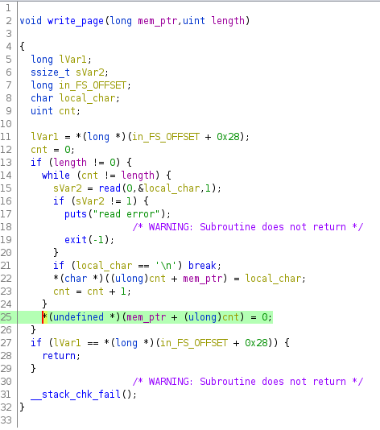

# ghost-diary - Points: 500

This challenge was released and available to everyone without having to unlock any of the previous challenges

Comment:
> It launched without prerequisite problems due to an error with bundling. If you are not experienced with binary exploitation I would recommend saving this for later. - Daniel T (PicoCTF instructor)

## Short Version

- Off by one vulnerability, null byte poison
- Populate Tcache bin and reuse memory to leak heap address
- Exhaust Tcache bin to force unsorted bin to leak libc addresses
- Use null byte overwrite to free and coalesce already used memory
- Allocate overlapping chunks and use tcache poisoning to get arbitary pointer allocated
- Overwrite `__free_hook` with magic one gadget to pop shell
- Profit!

## Longer Version

### Heap Challenges

Other than some very trivial dtmalloc challenges, I tend to shy away from heap challenges. The constantly changing ptmalloc implemenation, the complexity involved, just didn't appeal to me. But this is a PicoCTF challenge, how hard could it be right? 

Well turns out it was harder than I had expected. Unlike all the other Pico challenges, this challenge didn't seem to have one clear 'technique' that it was trying to point out and get you to learn.

### Binary Info

```python
[*] './ghostdiary'
    Arch:     amd64-64-little
    RELRO:    Full RELRO
    Stack:    Canary found
    NX:       NX enabled
    PIE:      PIE enabled
```

### Libc Info
```C
gef➤  call (char*)gnu_get_libc_version()
$1 = 0x7f8f17a5f618 <__libc_version> "2.27"
```

##### Typical Menu:
```C
1. New page in diary
2. Talk with ghost
3. Listen to ghost
4. Burn the page
5. Go to sleep
> 
```

Looks like we have alloc/free/read/write access, great!

## Step 0x01: Analyze the binary
#### Vulnerablity

After some analysis, we look at the "write_page" function (my name for it...)



Can you spot it? The function reads one character at a time, terminates early if it's a new line, but then makes sure the string is terminated with a NULL. But if the last character is not a newline, it'll result in the `cnt` being off by one (one more than the total length). So with the right alignment it'll overwrite the lowest byte of the next chunk in the heap with zero [Poison Null Byte](https://github.com/shellphish/how2heap/blob/master/glibc_2.25/poison_null_byte.c).

#### Constraints

 - Limited to `0x14(20)` pages
 - One page can hold up to < `0xF1(241)` bytes
 - Two pages can hold anywhere from `0x10f(271)` - `0x1e1(481)` bytes
 - We can't allocate anything over `480` bytes and inbetween the `241` and `271` bytes.
 - Allocated page pointers are stored in a table in .data.
 - Freed/burnt page pointers are zero'd out (so no double free)
 - Libc 2.27, so we have tcache enable, but a lot of older heap attacks won't work.

## Step 0x02: Leak something

OK, as a "heap newbie", I had to play around a bit... Playing around with the [how2heap malloc playground](https://github.com/shellphish/how2heap/blob/master/malloc_playground.c), together with [GEF](https://gef.readthedocs.io/en/master/) heap analysis option really helped give a deeper understanding of what's going on.

After some reading I was able to figure out that allocating a couple of same sized chunks, and then freeing them led to them having pointers to each other due to the way tcache creates a single linked list.

By creating the chunks, freeing them, and then allocating that same memory again, would allow me to read out the contents of the heap memory. Since there was no re-initization of memory on the heap, this meant I could leak a heap address.

**But now what?** 
「(´･ ･｀｡)ノ”

Well I wanted to get a Libc leak... But how do we do that if we're dealing with a PIE binary, and only have heap memory we can read from?

Lots of experimentation, lots of dead ends, but ultimately lots of knowledge gained...

Tcache apparently only holds up to 7 entries, if you create more than 7 chunks, make sure you have a chunk between the top chunk and the one's being freed, you can get chunks to be binned into the unsorted bin. This means that there is a pointer in the libc main_arena that points to this chunk, and pointers in that chunk that point back to main_arena. A doubly linked list. 

This means that we now have two libc pointers to leak!

**But now what?**

How can we use this information??? Well luckily others have already solved problems like this one, and done excelent write-ups: https://vigneshsrao.github.io/babytcache/

The whole write-up is interesting, but particularily the first part.

Since we have a null poison byte, we can reduce the size of a chunk on the heap, and since it also clears the prev_inuse bit, we can get it to combine with a previous memory location to free memory we have active pointers to. 

We can craft a fake chunk in heap memory that is larger than the allowed alloc size, EG:
```
pg0: 0x1e0
pg1: 0x40
pg2: 0x50
pg3: 0x60
pg4: 0x28 <--- this one does the overflow of the next chunk size
pg5: 0x1e0
pg6: 0x90
```
Page 4 is the size 0x28 chunk and can overwrite page 5 making it's prev_inuse bit cleared and making the chunk size 0x100. Important note here is that when you clear the prev_inuse bit, make sure to make the preceeding 8 bytes hold the prev_size of the imaginary chunk (I used 0x330).

You can set the start of this imaginary fake chunk at the beginning of the heap (write page 0) with a correct size. I used 0x331 and create fd/bk pointers that will pass the check. [P->fd->bk == P and P->bk->fd == P*](https://heap-exploitation.dhavalkapil.com/diving_into_glibc_heap/security_checks.html)

Then when you free page 5... you'll get memory freed all the way back to the start of the heap.

At this point, when you allocate a new chunk it's overlapping existing memory!

### Step 0x03: Pwnage!

A bit of [tcache poisoning](https://github.com/shellphish/how2heap/blob/master/glibc_2.26/tcache_poisoning.c) and we can get malloc to return an arbitary pointer of our chosing. There are less security checks in place for tcache bins than for fastbins. A step backwards if you ask me...

I chose to overwrite `__free_hook` in libc with a magic gadget to pop a shell and tada... cat the flag.txt file

```python
[*] '/problems/ghost-diary_5_7e39864bc6dc6e66a1ac8f4632e5ffba/ghostdiary'
    Arch:     amd64-64-little
    RELRO:    Full RELRO
    Stack:    Canary found
    NX:       NX enabled
    PIE:      PIE enabled
[*] '/lib/x86_64-linux-gnu/libc.so.6'
    Arch:     amd64-64-little
    RELRO:    Partial RELRO
    Stack:    Canary found
    NX:       NX enabled
    PIE:      PIE enabled
[+] Starting local process '/problems/ghost-diary_5_7e39864bc6dc6e66a1ac8f4632e5ffba/ghostdiary': pid 3801797
0x5654dbd66d30
-----------------------------------------------------------------------------------------
HEAPBASE: 0x5654dbd66000
0x7fee844fd070
-----------------------------------------------------------------------------------------
LIBC_BASE: 0x7fee84111000
LIBC_BASE: 0x7fee84111000
HEAP_BASE: 0x5654dbd66000
[*] Switching to interactive mode
$ ls
flag.txt  ghostdiary  ghostdiary.c
$ cat flag.txt
picoCTF{nu11_byt3_Gh05T_abf74d12}
```

