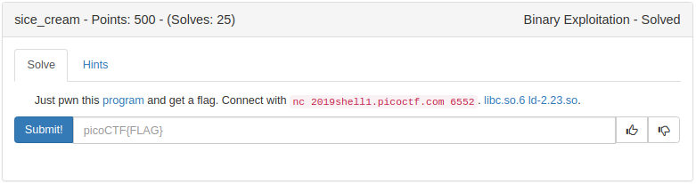
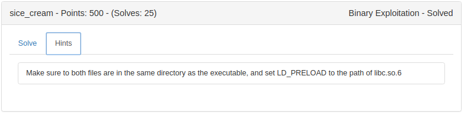

#  sice_cream - Points: 500


### Description

Just pwn this [program](./bins/sice_cream) and get a flag. Connect with `nc 2019shell1.picoctf.com 6552`. [libc.so.6](./bins/libc.so.6), [ld-2.23.so](./bins/ld-2.23.so).

### Hint

`Make sure to _put_ both files are in the same directory as the executable, and set LD_PRELOAD to the path of libc.so.6`


## Short version

- Name buffer is not null terminated, so use that to leak heap address
- Use double free to then...
- Use fastbin attack to control next pointer
- alloc memory in .data section
- Leverage that to create fake chunk to free, thereby placing libc addresses in .data section
- Leak libc addresses
- control pointer tables to allow arbitary heap address to be freed
- use small allocations to create larger fake chunks on the heap to free 
- abuse heap memory to resize unsorted bins so that one of the unsorted bins will get placed in the right smallbin:4
- overwrite unsorted bin BK ptr to `_IO_list_all-0x10`
- Update the chunk in smallbin:4 with file structure with relevant data to pass checks
- Create vtable struct with function pointers in .data section
- trigger malloc from unsorted bin in order to trigger overwrite of `_IO_list_all` pointer, and cause abort handler to run
- PROFIT!!!!

All it all, this was super fun to solve. I went from knowing hardly anything about the heap, to having my mind BLOWN... I'm not sure if this was the intended solution, but it was fun none the less.


---

## Long version
### Challenge Type: HEAP

Right from the start we can see that we get the usual menu associated with heap challenges. malloc/free etc.: 
```python
$ ./sice_cream 
Welcome to the Sice Cream Store!
We have the best sice cream in the world!
Whats your name?
> AAAAAA
1. Buy sice cream
2. Eat sice cream
3. Reintroduce yourself
4. Exit
> 
```
### Disclaimer
Before this years PicoCTF I had shied away from heap challenges. I was not a fan, I did not invest the time into figuring out the various techniques, and how the various heap implementations worked. These challenges were outside of my comfort zone, and pushed me to learn more. 


### Binary Info
```C
$ checksec ./sice_cream
    Arch:     amd64-64-little
    RELRO:    Full RELRO               (No overwriting GOT entries)
    Stack:    Canary found
    NX:       NX enabled
    PIE:      No PIE (0x400000)
    RUNPATH:  './'
```

Additionally lets not forget about the provided libc and ld libraries. Lets figure out the version we're dealing with:

```python
$ gdb ./sice_cream
gef➤  start
gef➤  call (char*)gnu_get_libc_version()
$1 = 0x7ffff7b9b5aa "2.23"
gef➤  
```
Great, so we're doing with an old version of libc. A little research and we see that Ubuntu 16.04 still uses libc 2.23. So time to setup a VM with that version and the libc-dbg packages installed.

#### Memory layout
```lua
gef➤  vmmap
Start              End                Offset             Perm Path
0x0000000000400000 0x0000000000402000 0x0000000000000000 r-x /home/caesurus/CTF_Writeups/2019-PicoCTF/PWN-sice_cream/bins/sice_cream
0x0000000000601000 0x0000000000602000 0x0000000000001000 r-- /home/caesurus/CTF_Writeups/2019-PicoCTF/PWN-sice_cream/bins/sice_cream
0x0000000000602000 0x0000000000603000 0x0000000000002000 rw- /home/caesurus/CTF_Writeups/2019-PicoCTF/PWN-sice_cream/bins/sice_cream
0x00000000011e1000 0x0000000001224000 0x0000000000000000 rw- [heap]
0x00007f4c922d5000 0x00007f4c92495000 0x0000000000000000 r-x /home/caesurus/CTF_Writeups/2019-PicoCTF/PWN-sice_cream/bins/libc.so.6
0x00007f4c92495000 0x00007f4c92695000 0x00000000001c0000 --- /home/caesurus/CTF_Writeups/2019-PicoCTF/PWN-sice_cream/bins/libc.so.6
0x00007f4c92695000 0x00007f4c92699000 0x00000000001c0000 r-- /home/caesurus/CTF_Writeups/2019-PicoCTF/PWN-sice_cream/bins/libc.so.6
0x00007f4c92699000 0x00007f4c9269b000 0x00000000001c4000 rw- /home/caesurus/CTF_Writeups/2019-PicoCTF/PWN-sice_cream/bins/libc.so.6
0x00007f4c9269b000 0x00007f4c9269f000 0x0000000000000000 rw-
0x00007f4c9269f000 0x00007f4c926c5000 0x0000000000000000 r-x /home/caesurus/CTF_Writeups/2019-PicoCTF/PWN-sice_cream/bins/ld-2.23.so
0x00007f4c928c1000 0x00007f4c928c4000 0x0000000000000000 rw-
0x00007f4c928c4000 0x00007f4c928c5000 0x0000000000025000 r-- /home/caesurus/CTF_Writeups/2019-PicoCTF/PWN-sice_cream/bins/ld-2.23.so
0x00007f4c928c5000 0x00007f4c928c6000 0x0000000000026000 rw- /home/caesurus/CTF_Writeups/2019-PicoCTF/PWN-sice_cream/bins/ld-2.23.so
0x00007f4c928c6000 0x00007f4c928c7000 0x0000000000000000 rw-
0x00007ffe589cf000 0x00007ffe589f1000 0x0000000000000000 rw- [stack]
0x00007ffe589f8000 0x00007ffe589fb000 0x0000000000000000 r-- [vvar]
0x00007ffe589fb000 0x00007ffe589fd000 0x0000000000000000 r-x [vdso]
0xffffffffff600000 0xffffffffff601000 0x0000000000000000 r-x [vsyscall]
```

.data section:
```C
        +----------------------+
        |  0x0000000000602000  |
        |                      |
        |                      |
        |  0x0000000000602040  | <---------+ Global Name Buffer.
        |                      |             0x100 bytes to store name
        |                      |
        |                      |
        |                      |
        |                      |
        |                      |
        |  0x0000000000602140  | <---------+ Global Pointer Table.
        |                      |             After malloc returns pointer
        |                      |             it gets stored here in the next
        |          .           |             available slot
        |          .           |
        |          .           |
        |          .           |
        |                      |
        |                      |
        |                      |
        |  0x0000000000603000  |
        +----------------------+
```
### Abilities and Limitations
- Can only create chunks of up to 88 bytes, any more and we are forcibly ejected.
- Can reintroduce ourselves as many times as we want
- Pointer entries in the table are persistent, when an entry is freed, it is not set to zero
- This means we can only create 20 chunks and pointer entries before we run out of space


#### Leak heap address
If we "reintroduce ourselves", and make our name with printable characters through the full buffer, eg:"A"*0x100, we are able to leak the first pointer on the Global Pointer Table.

#### Now what?
After chosing the 'Eat sice cream' and providing an index, the pointer is freed, but the entry stays in the table. This allow for a double free.  

#### Fast bin attack
So allocate three chunks. 
```
Chunk0 - 80 bytes  
Chunk1 - 80 bytes  
Chunk2 - 80 bytes  <- this chunk will keep the other two from coalescing with the top chunk when freed
```


* Free `Chunk0`, this will be added to fastbin 4 list
* Free `Chunk1`, `Chunk0` will be updated to point to `Chunk1` is thereby added to the fastbin
* Free `Chunk0` again, `Chunk1` will be updated to point to `Chunk0` so the fastbin looks like this:


```C
[+] No Tcache in this version of libc
───────────────────────────────────── Fastbins for arena 0x7fb2b0760b20 ─────────────────────────────────────
Fastbins[idx=0, size=0x10] 0x00
Fastbins[idx=1, size=0x20] 0x00
Fastbins[idx=2, size=0x30] 0x00
Fastbins[idx=3, size=0x40] 0x00
Fastbins[idx=4, size=0x50]  ←  Chunk(addr=0x----010, size=0x60, flags=PREV_INUSE)  ←  Chunk(addr=0x----070, size=0x60, flags=PREV_INUSE)  ←  Chunk(addr=0x----010, size=0x60, flags=PREV_INUSE)  →  [loop detected]
Fastbins[idx=5, size=0x60] 0x00
Fastbins[idx=6, size=0x70] 0x00
───────────────────────────────── Unsorted Bin for arena '*0x7fb2b0760b20' ─────────────────────────────────
[+] Found 0 chunks in unsorted bin.
────────────────────────────────── Small Bins for arena '*0x7fb2b0760b20' ──────────────────────────────────
[+] Found 0 chunks in 0 small non-empty bins.
────────────────────────────────── Large Bins for arena '*0x7fb2b0760b20' ──────────────────────────────────
[+] Found 0 chunks in 0 large non-empty bins.
```

Now Alloc something from that fasbin. Since it's on the list twice, we can update the pointer to point to where ever we want. But we need to make sure that the chunk size is correct before we do actually allocate that last chunk.

Since we have memory in .data that we can easily overwrite with 0x100 bytes (the buffer holding our "Name"), we can point there.
```c
Fastbins[idx=4, size=0x50]  ←  Chunk(addr=0x----010, size=0x60, flags=PREV_INUSE)  ←  Chunk(addr=0x602050, size=0x60, flags=PREV_INUSE)  ←  Chunk(addr=0x602130, size=0x4141414141414140, flags=PREV_INUSE) [incorrect fastbin_index]  ←  [Corrupted chunk at 0x4141414141414151]
```

Note that two new addresses are added to that fastbin, the first is at the start of our "Name" buffer, and then another pointing to right before the Global Pointer Table. The size of that last chunk isn't correct yet. This is fine for now. We can fix this when we write to our "Name" buffer again . To fix this we just make sure we write 0x61 to the right location. We want that last chunk on the fast bin so that we can overwrite the Global Pointer Table with nulls (or arbitrary memory locations of fake chunks) so we're not limited to 20 allocations.

So now we can allocate the next chunk to remove it from the fastbin list, and the next allocation will be our pointer to .data.

#### Now what 2.0?

OK, so to recap. 

- We have a heap chunk in .data where we can overwrite it.
- We have a ptr to the .data section that can now be freed.
- we have a fastbin chunk so we can get an alloc overlapping the Global Pointer Table
- We have full control of what pointers we want to free (by updating the Global Pointer Table)

But we still need to get another leak... somehow...

- Stack leak? This didn't seem possible, so it's a no go
- Libc leak? There didn't look like there were any libc addresses on the heap that I could leak...

After quite a bit of reading it turns out you can allocate a chunk of memory that is bigger than any of the fast bins, and free that so that it has a doubly linked list that starts in libc. Thereby having libc write those pointers to heap memory. 

The problem is that we can't allocate more than 88 bytes!!!

**But all is not lost**. Since we control 0x100 bytes of memory in .data section, we can create a fake chunk and free that!
```C
        +----------------------+----------+
        |  0x0000000000602000  |          |
        |                      |          |
        |                      |          |
        |  0x0000000000602040  |     0x00 |
        |                      |     0xc1 | <--------+ Chunk Size. Big enough not to be in fastbin
        |  0x0000000000602050  |       .  | <--------+ This will be the pointer we will free
        |                      |       .  |
        |                      |       .  |
        |                      |       .  |
        |                      |       .  |
        |                      |       .  |
        |                      |       .  |
        |                      |     0xc0 | <--------+ PrevSize
        |                      |     0x21 | <--------+ Chunk Size (PrevInUse bit set)
        |                      |       .  |
        |                      |       .  |
        |                      |     0x20 | <--------+ PrevSize
        |                      |     0x21 | <--------+ Chunk Size (PrevInUse bit set)
        |  0x0000000000602140  |          |
        |                      |          |
        |          .           |          |
        |          .           |          |
        |          .           |          |
        |          .           |          |
        |                      |          |
        |  0x0000000000603000  |          |
        +----------------------+----------+
```
Once we free the `0x602050` pointer, it will get added to the unsorted bin! We can then "reintroduce" and write "A" up until that pointer and it will print out the leaked libc address.

**GREAT!!!**

#### Now what 3.0?

So we have:

- Libc leak
- Heap leak

We have some idea of what to override. A lot of challenges use the 0x7f before `__malloc_hook` to put a pointer on the relevant fastbin, then allocate memory, overwrite `__malloc_hook` and win! 

But even if we create a fake fastbin chunk of the right size, we can't call malloc with anything over 88 bytes. So that approach won't work. 

And this is where I got stuck for a couple of days. I visited all the usual heap resources:

- [Dhaval Kapil's ebook](https://heap-exploitation.dhavalkapil.com/diving_into_glibc_heap/security_checks.html)
- [How2Heap](https://github.com/shellphish/how2heap/blob/master/README.md)
- to name but a few...

All the usual suspects seemed to be dead ends. I kept coming back to [House Of Orange](https://github.com/shellphish/how2heap/blob/master/glibc_2.25/house_of_orange.c). But that involves overwriting the top chunk and doing a larger alloc than we're able to do. The problem was consistently that I couldn't find a way to get an arbitrary pointer returned. I started reading up on the later part of the attack [FileStreamOrientedProgramming](https://www.slideshare.net/AngelBoy1/play-with-file-structure-yet-another-binary-exploit-technique).

That seemed _WAY_ too complicated for a PicoCTF challenge. "I must be missing something" I told myself.

After many more dead ends, I finally decided to dig in and try to figure out how this [FSOP](https://www.slideshare.net/AngelBoy1/play-with-file-structure-yet-another-binary-exploit-technique) thing works. 

#### Home stretch 

After a LOT of playing with the [How2Heap mallc playground](https://github.com/shellphish/how2heap/blob/master/malloc_playground.c), and running the [House Of Orange](https://github.com/shellphish/how2heap/blob/master/glibc_2.25/house_of_orange.c) on the libc 2.23, I finally started to grok it.

Digging into the full technique is overkill since it's covered in so much detail elsewhere.

> This corresponds to , which holds all the smallbins of sizes between 90 and 98.

My overly simplified summary of [House Of Orange](https://github.com/shellphish/how2heap/blob/master/glibc_2.25/house_of_orange.c) is:

+ Uses an overwrite of the top chunk, together with a large alloc to cause a libc internal update to bins which causes a controlled pointer to be placed in the _small 0x50-0x60 sized bin_ (smallbin:4).
+ The FD/BK pointers are updated in an unsorted bin, so that when the next malloc occurs the libc top chunk pointer is written to BK ptr+0x10. 
+ libc then does additional security/integrity checks and if those fail, the abort handler is called to print additional information.
+ If the `_IO_list_all` file pointer pointer is set, there is code to eventually call `_IO_flush_all_lockp` 
+ that will do checks on that file pointer structure, 
+ if those pass, it will step through a vtable entry that contains a list of function pointers.
+ it will call each function with the pointer to that file structure

The crux of the issue was that we can't do a large malloc. So how do we trigger the same conditions given our constraints.
I managed to do this with the following steps:

- create multiple 88 byte allocations on the heap
- create fake chunks so it looks like this:
```
chunk with size 0xc0
chunk with size 0x20
chunk with size 0xc0
chunk with size 0x20
```
- update the Global Pointer Table with pointers to the `0xc0` sized chunks
- Free those chunks.

Since there is a used chunk inbetween the two larger chunks, this ensures we have two chunks in the unsorted bin.
Now the fun starts. I used the Global Name Buffer to create fake fastbin chunks that allow us to create overlapping chunks right before the unsorted bin chunks.
I then updated the size of the chunks to 0x60 (being careful to make sure the prev_size is also set so it passes the correct checks)

If we inspect the unsorted bins, we now have two unsorted bins with size 0x60.

Next I called a small malloc of 10 bytes to force libc to consume memory from one of the unsorted bins, and it places the other chunk into smallbin-4. Thereby setting up the main arena with a pointer to our chunk.

**_Almost there_**

- Next thing to do is update the unsorted bin chunks' BK ptr to `_IO_list_all-0x10`
- Update the memory of the chunk in the smallbin:4 as our fake file structure (make sure to pass all constraints, contains the data we want passed to our eventual function call (/bin/sh), and have vtable ptr point to our .data controlled memory).
- Update the .data controlled memory (Global Name Buffer) with pointers to the "function" we want called, I used `libc.symbols['system']`

### All set
Now all our memory is set up and we just need to trigger an abort. We can do this the same way the original did it. By allocating memory with a size smaller than what's in the unsorted bin.

Once triggered, you see the abort handler kick in and print out it's error handling, but then we also get execution control!

```
*** Error in `/problems/sice-cream_2_fc6c2a415935e4010e4e221e6d965a34/sice_cream': malloc(): memory corruption: 0x00007f42c193f520 ***
======= Backtrace: =========
./libc.so.6(+0x777e5)[0x7f42c15f17e5]
./libc.so.6(+0x8213e)[0x7f42c15fc13e]
./libc.so.6(__libc_malloc+0x54)[0x7f42c15fe184]
/problems/sice-cream_2_fc6c2a415935e4010e4e221e6d965a34/sice_cream[0x4009d8]
/problems/sice-cream_2_fc6c2a415935e4010e4e221e6d965a34/sice_cream[0x400c8f]
./libc.so.6(__libc_start_main+0xf0)[0x7f42c159a830]
/problems/sice-cream_2_fc6c2a415935e4010e4e221e6d965a34/sice_cream[0x4007ea]
======= Memory map: ========
00400000-00402000 r-xp 00000000 103:01 86021158                          /problems/sice-cream_2_fc6c2a415935e4010e4e221e6d965a34/sice_cream
00601000-00602000 r--p 00001000 103:01 86021158                          /problems/sice-cream_2_fc6c2a415935e4010e4e221e6d965a34/sice_cream
00602000-00603000 rw-p 00002000 103:01 86021158                          /problems/sice-cream_2_fc6c2a415935e4010e4e221e6d965a34/sice_cream
01e62000-01e83000 rw-p 00000000 00:00 0                                  [heap]
7f42bc000000-7f42bc021000 rw-p 00000000 00:00 0 
7f42bc021000-7f42c0000000 ---p 00000000 00:00 0 
7f42c1362000-7f42c1379000 r-xp 00000000 103:01 2096                      /lib/x86_64-linux-gnu/libgcc_s.so.1
7f42c1379000-7f42c1578000 ---p 00017000 103:01 2096                      /lib/x86_64-linux-gnu/libgcc_s.so.1
7f42c1578000-7f42c1579000 r--p 00016000 103:01 2096                      /lib/x86_64-linux-gnu/libgcc_s.so.1
7f42c1579000-7f42c157a000 rw-p 00017000 103:01 2096                      /lib/x86_64-linux-gnu/libgcc_s.so.1
7f42c157a000-7f42c173a000 r-xp 00000000 103:01 86021159                  /problems/sice-cream_2_fc6c2a415935e4010e4e221e6d965a34/libc.so.6
7f42c173a000-7f42c193a000 ---p 001c0000 103:01 86021159                  /problems/sice-cream_2_fc6c2a415935e4010e4e221e6d965a34/libc.so.6
7f42c193a000-7f42c193e000 r--p 001c0000 103:01 86021159                  /problems/sice-cream_2_fc6c2a415935e4010e4e221e6d965a34/libc.so.6
7f42c193e000-7f42c1940000 rw-p 001c4000 103:01 86021159                  /problems/sice-cream_2_fc6c2a415935e4010e4e221e6d965a34/libc.so.6
7f42c1940000-7f42c1944000 rw-p 00000000 00:00 0 
7f42c1944000-7f42c196a000 r-xp 00000000 103:01 86021160                  /problems/sice-cream_2_fc6c2a415935e4010e4e221e6d965a34/ld-2.23.so
7f42c1b65000-7f42c1b69000 rw-p 00000000 00:00 0 
7f42c1b69000-7f42c1b6a000 r--p 00025000 103:01 86021160                  /problems/sice-cream_2_fc6c2a415935e4010e4e221e6d965a34/ld-2.23.so
7f42c1b6a000-7f42c1b6b000 rw-p 00026000 103:01 86021160                  /problems/sice-cream_2_fc6c2a415935e4010e4e221e6d965a34/ld-2.23.so
7f42c1b6b000-7f42c1b6c000 rw-p 00000000 00:00 0 
7fff472d9000-7fff472fa000 rw-p 00000000 00:00 0                          [stack]
7fff47338000-7fff4733b000 r--p 00000000 00:00 0                          [vvar]
7fff4733b000-7fff4733d000 r-xp 00000000 00:00 0                          [vdso]
ffffffffff600000-ffffffffff601000 r-xp 00000000 00:00 0                  [vsyscall]
$ cat flag.txt
flag{th3_r3al_questi0n_is_why_1s_libc_2.23_still_4_th1ng_148c832c}
$ ls
flag.txt
ld-2.23.so
libc.so.6
sice_cream
xinet_startup.sh
```

AWESOME!!!

`flag{th3_r3al_questi0n_is_why_1s_libc_2.23_still_4_th1ng_148c832c}`


