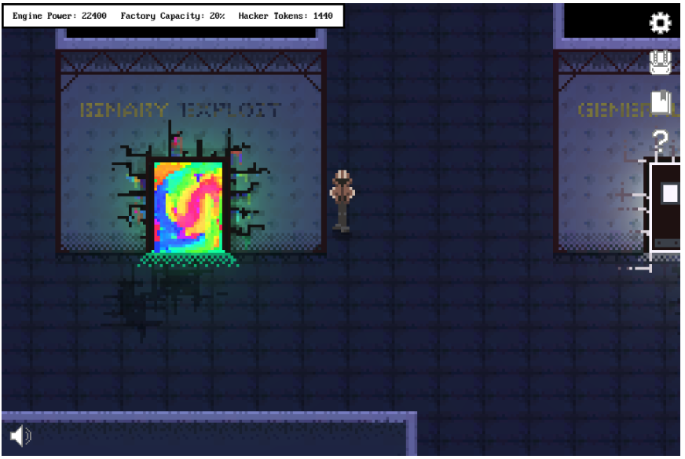

# PicoCTF 2019

PicoCTF is historically an AWESOME CTF. It's especially great if you're new to CTFs and want to get started. The team does an awesome job of preparing the game, and the challenges start really easy and have a gradual difficulty curve. The out did themselves with the "game" this year. 
. 

Luckily you don't have to walk around the game the whole time, you can access the challenges via the "Challenge Problems" link.

I enjoy the 2 week period because I use the time to try to get as many people excited about CTFs as possible. I tell everyone about it, and try to get everyone involved and playing along. Everyone from my 10 year old son, to my work colleagues with years of CS experience.

## Different Categories

 - Binary Exploitation
 - Cryptography
 - Forensics
 - General Skills
 - Reverse Engineering
 - Web Exploitation

### Not only for beginners
While there are many many challenges, and the majority of them are geared toward beginners, the organizers throw in some harder challenges as well. 

I'd like to cover a couple of those, hopefully adding as I find time

- [sice_cream - 500 pts](./PWN-sice_cream)
- [ghost_diary - 500 pts](./PWN-ghost_diary)
- [times_up_one_last_time - 500 pts](./RE-times_up_one_last_time)