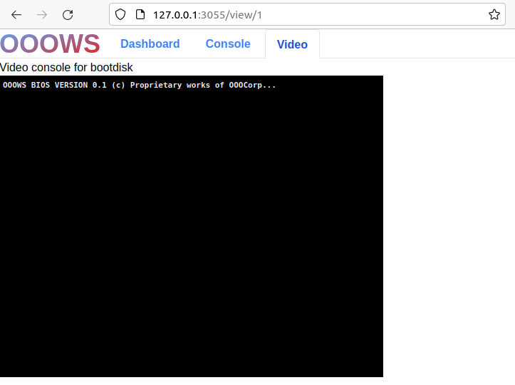

# ooows-flag-baby challenge

This was the first challenge in a series of virtualization challenges. 
As the name implies, the challenge was meant to be a simple starter/warmup challenge. 
On the first day I started looking at the challenge and found that I was pretty much out of my comfort zone and more than a bit clueless.

Luckily there were others on the team that knew what was going on. 
However, I felt pretty inadequate for not being able to solve this, so I made it a personal goal to solve this later, once the competition was over.

## TLDR:
 - ooows presumably stands for `Order Of the Overflow Web Services`
 - Challenge is to interface with I/O ports and retrieve flag
 - Create MBR with custom code that
  - interfaces with I/O port connected to `noflag` which in turn starts `noflag.sh`
  - sends data to program FILENAME (beware of the filter)
  - send magic to trigger file open
  - read back flag contents
  - output flag back out to the serial port via I/O port
- View flag via web interface serial port

## High Level Overview:
Here is a high level overview of what is running in the container, and what the various binaries/scripts do. 
```
┌─────────────────┬──────────────────────────────────────────────────────────────────────────────────────────────────────────────┐
│"ooows" Container│                                                                                                              │
├─────────────────┘                                                                                                              │
│                                                                                                                                │
│                                                           ┌───────────────────────┬─────────────────────────────────────────┐  │
│   devices.config   // definition of devices and mem map   │ VM spawned via vmm.py │                                         │  │
│   Dockerfile       // used to build the container         ├───────────────────────┘                                         │  │
│   supervisord.conf // used to start web app               │                                                                 │  │
│   vmm              // binary to interface with /dev/kvm   │  - devices.config defines io port accesses to external scripts  │  │
│                                                           │  - custom bios written by ooo                                   │  │
│                                                           │  - Disk uploaded by user and attached to VM                     │  │
│   web                                                     │                                                                 │  │
│    | app.py        // main web app                        │                                                                 │  │
│    | console.py                                           │                                                                 │  │
│    | init-db.py                                           │                                                                 │  │
│    | schema.sql                                           │                                                                 │  │
│    | video.py                                             │                                                                 │  │
│    | vmm.py        // vmmWorker (invocation of vmm)       │                                                                 │  │
│                                                           │                                                                 │  │
│                                                           │                                                                 │  │
│   devices-bin                                             │                                                                 │  │
│    | noflag        ──┐                                    │                                                                 │  │
│    | noflag.sh       │        attached to vm io           │                                                                 │  │
│    | ooowsdisk.py    ├────────────────────────────────────┤                                                                 │  │
│    | ooowsserial.py  │                                    │                                                                 │  │
│    | vga           ──┘                                    │                                                                 │  │
│                                                           │                                                                 │  │
│                                                           │                                                                 │  │
│   bios                                                    │                                                                 │  │
│    | bios                                                 │                                                                 │  │
│                                                           │                                                                 │  │
│                                                           │                                                                 │  │
│                                                           │                                                                 │  │
│                                                           └─────────────────────────────────────────────────────────────────┘  │
│                                                                                                                                │
└────────────────────────────────────────────────────────────────────────────────────────────────────────────────────────────────┘
```

The web interface is nice and simple.

 

The `Upload a virtual disk` button allows us to upload a disk image. 
Once uploaded, a VM shows up that can be started, and the boot process can be observed via the `Video` button



By default, nothing shows up on the serial console. This is because the `bios` outputs to `vga` and doesn't do anything with the serial interface.

It seemed pretty obvious that the `noflag.sh` script was what needed to be triggered. 
Regardless of that, we still spent time looking for obvious vulnerabilities in the web app code. There didn't seem to be anything obvious so now what?

Where do I start with all this?

### Disassemble the bios
Since the VM starts execution with the `bios` let's inspect that and see if we can figure out what's going on there.

After opening up the file with binja, we see something strange in the `Feature map`:


Whip up a quick script to convert the bytes to something printable, assume 0x00 is supposed to be a space (`0x20`)
```
with open('./bios', 'rb') as f:
    data = f.read()[0x200:0x1500]

    for j in range(64, 300, 32):
        print('-' * 80, j, '-' * 80)

        cnt = 0
        for i in data:
            if not cnt % j:
                print('')
            sys.stdout.write(chr(i+ord(' ')))

            cnt += 1
```
And we get something like this (if we do a newline every 64 bytes):
```
                                  000                           
                                  0%%000                        
                                 0%%%%%%0                       
                                 0%%%%%%%0                      
                                0%%%%%%%%%00                    
                                0%%%%%%%%%%%0                   
                                0%%%%%%%%%%%0                   
                               0%%%%%%%%%%%%%0                  
                               0%%%%%%%%%%%%%0                  
                               0%%%%%%%%%%%%%%0                 
            000          00   0%%%%%%%%%%%%%%%0                 
          00,,,0         0!0000%%%%%%%%%%%%%%%%0                
         0,,,,,,0       0))))!000%%%%%%%%%%%%%%0                
        0,,,,,,,,0  0000!))))))$$000%%%%%%%%%%%%0               
       0,,,,,,,,,0 0$$$0!)))))%,,,$$00%%%%%%%%%%0               
      0,,,,,,,,,,,00$$$0))))))%,,,,%)!000%%%%%%%0               
     0,,,,,,,,,,,,0$$$0!)))))),,,,,!)))!0000%%%%%0              
    0,,,,,,,,,,,,$0$$$0!)))))%,,,,,)))))0...000%%0              
   0,,,.,..,..,,,$0$$$0))))))$,,,,%))))0.....0!000              
  0,,.........,,,0$$$0!)))))!,,,,,!))))0....0)))!00             
  0,,............0$$$0))))))%,,,,$)))))0....0)))))!0            
   0,............0$$$0))))))$,,,,%))))0.....0))))))!00          
   0,,..........0$$$0!)))))!,,,,,)))))0....0)))))))))0          
   0,,,.........0$$$0))))))%,,,,$))))0.....0))))))))))00        
   0,,,........0$$$0!)))))),,,,,%))))0.....0)))))))))))!0       
   0,,,,,......0$$$0!)))))%,,,,,)))))0....0)))))))))))))!0      
   0,,,,,,.,,..0$$$0))))))$,,,,%))))0.....0)))))))))))))))0     
   0,,,,,,,,,,0$$$0!)))))),,,,,!))))0....0))))))))))))))))0     
   0,,,,,,,,,$0$$$0!)))))%,,,,$)))))0....0))))))))))))))))!     
   0,,,,,,,,,$0$$$0))))))$,,,,%))))0.....0)))))))))))))))))0    
    0,,,,,,,,0$$$0!)))))!,,,,,!))))0....0)))))))))))))))))))0   
    0,,,,,,,,0$$$0))))))%,,,,$))))0.....0)))))))))))))))))))0   
     0,,,,0000$$0!)))))),,,,,%))))0.....0))))))))))))))))))))0  
      0000  0$$$0!)))))!,,,,,)))))0....0)))))))))))))))))))))0  
            0$$$0))))))%,,,,%))))0.....0))))))))))))))))))))))0 
            00$0!)))))),,,,,!))))0.....0)))))))))))))))))))))!0 
              00!)))))%,,,,,)))))0....0)))))))))))))))))))))))0 
               0))))))$,,,,%))))0.....0)))))))))))))))))))))))0 
               0)))))!,,,,,!))))0.....0))))))0000)))))))))))))0 
              0!)))))%,,,,$)))))0....0)))))!0    00!))))))))))0 
              0))))))$,,,,%))))0.....0)))))0       0))))))))))0 
              00!)))!,,,,,!))))0....0))))))0        0)))))))))0 
                00!!%,,,,$))))0.....0)))))!0        0!))))))))0 
                  000$,,,%))))0.....0))))))0        0)))))))!0  
                  0%%00$$)))))0....0)))))))0        0)))))))0   
                 0%%%%%000!!)0.....0))))))))00     0!)))))!!0   
                 0%%%%%%%%0000.....0))))))))))000 0))))))!!0    
                 0%%%%%%%%%%%000..0)))))))))))))!0))))))00      
                0%%%%%%%%%%%%%%%000!))))))))))))))))))00        
                0%%%%%%%%%%%%%%%%%000!!)))))))))))0000          
                0%%%%%%%%%%%%%%%%%%%00000000000000              
               0%%%%%%%%%%%%%%%%%%%%0                           
               0%%%%%%%%%%%%%%%%%%%0                            
              0%%%%%%%%%%%%%%%%%%0                              
              0%%%%%%%%%%%%%%%%00                               
              000%%%%%%%%%%%%00                                 
                 00%%%%%%%000                                   
                   0000000                                      
```
Printing a newline every 128 bytes:
```    
                                   000                                                             0%%000                       
                                  0%%%%%%0                                                        0%%%%%%%0                     
                                 0%%%%%%%%%00                                                    0%%%%%%%%%%%0                  
                                 0%%%%%%%%%%%0                                                  0%%%%%%%%%%%%%0                 
                                0%%%%%%%%%%%%%0                                                 0%%%%%%%%%%%%%%0                
             000          00   0%%%%%%%%%%%%%%%0                           00,,,0         0!0000%%%%%%%%%%%%%%%%0               
          0,,,,,,0       0))))!000%%%%%%%%%%%%%%0                        0,,,,,,,,0  0000!))))))$$000%%%%%%%%%%%%0              
        0,,,,,,,,,0 0$$$0!)))))%,,,$$00%%%%%%%%%%0                     0,,,,,,,,,,,00$$$0))))))%,,,,%)!000%%%%%%%0              
      0,,,,,,,,,,,,0$$$0!)))))),,,,,!)))!0000%%%%%0                  0,,,,,,,,,,,,$0$$$0!)))))%,,,,,)))))0...000%%0             
    0,,,.,..,..,,,$0$$$0))))))$,,,,%))))0.....0!000                0,,.........,,,0$$$0!)))))!,,,,,!))))0....0)))!00            
   0,,............0$$$0))))))%,,,,$)))))0....0)))))!0               0,............0$$$0))))))$,,,,%))))0.....0))))))!00         
    0,,..........0$$$0!)))))!,,,,,)))))0....0)))))))))0             0,,,.........0$$$0))))))%,,,,$))))0.....0))))))))))00       
    0,,,........0$$$0!)))))),,,,,%))))0.....0)))))))))))!0          0,,,,,......0$$$0!)))))%,,,,,)))))0....0)))))))))))))!0     
    0,,,,,,.,,..0$$$0))))))$,,,,%))))0.....0)))))))))))))))0        0,,,,,,,,,,0$$$0!)))))),,,,,!))))0....0))))))))))))))))0    
    0,,,,,,,,,$0$$$0!)))))%,,,,$)))))0....0))))))))))))))))!0       0,,,,,,,,,$0$$$0))))))$,,,,%))))0.....0))))))))))))))))))0  
     0,,,,,,,,0$$$0!)))))!,,,,,!))))0....0)))))))))))))))))))0       0,,,,,,,,0$$$0))))))%,,,,$))))0.....0))))))))))))))))))))0 
      0,,,,0000$$0!)))))),,,,,%))))0.....0))))))))))))))))))))0        0000  0$$$0!)))))!,,,,,)))))0....0))))))))))))))))))))))0
             0$$$0))))))%,,,,%))))0.....0)))))))))))))))))))))!0             00$0!)))))),,,,,!))))0.....0))))))))))))))))))))))0
               00!)))))%,,,,,)))))0....0)))))))))))))))))))))))0                0))))))$,,,,%))))0.....0)))))))))))))))))))))))0
                0)))))!,,,,,!))))0.....0))))))0000)))))))))))))0               0!)))))%,,,,$)))))0....0)))))!0    00!))))))))))0
               0))))))$,,,,%))))0.....0)))))0       0))))))))))0               00!)))!,,,,,!))))0....0))))))0        0)))))))))0
                 00!!%,,,,$))))0.....0)))))!0        0!))))))!0                    000$,,,%))))0.....0))))))0        0)))))))0  
                   0%%00$$)))))0....0)))))))0        0))))))!0                    0%%%%%000!!)0.....0))))))))00     0!)))))!0   
                  0%%%%%%%%0000.....0))))))))))000 0))))))!!                      0%%%%%%%%%%%000..0)))))))))))))!0))))))00     
                 0%%%%%%%%%%%%%%%000!))))))))))))))))))00                        0%%%%%%%%%%%%%%%%%000!!)))))))))))0000         
                 0%%%%%%%%%%%%%%%%%%%00000000000000                             0%%%%%%%%%%%%%%%%%%%%0                          
                0%%%%%%%%%%%%%%%%%%%0                                          0%%%%%%%%%%%%%%%%%%0                             
               0%%%%%%%%%%%%%%%%00                                             000%%%%%%%%%%%%00                            
                  00%%%%%%%000                                                      0000000                                 
```
Anyway... doesn't look relevant to the challenge, but fun..

Let's look at the disassembly


Remember that we're dealing with 16bit here, so make sure to disassemble accordingly.
On the right we see the loop that presumably outputs the `OOOWS BIOS VERSION 0.1 (c) Proprietary works of OOOCorp` to the screen.

Then on the left we see it checking for the magic `0x55` and `0xaa` at the end of the MBR, and finally if those are where they are supposed to be, it will jump to `0x7c00` which is the start of the MBR.
You can't see it in the screenshot, but if the checks fail it outputs `Boot device not found`  

### Learn about the MBR
If the VM boots, and is running our uploaded disk, then we can have code execution on the box. What does that actually look like? I definitely hadn't created a MBR from scratch before. So time to do some searching!

I found this article: [custom master boot record](http://osteras.info/personal/2013/08/15/custom-master-boot-record.html)
It's a great, straight forward, concise article that contained just enough information for me to move on to the next step of the process.

One thing the article doesn't cover is debugging a bootloader. 

I did this with starting a VM with:

```qemu-system-i386 -hda bootdisk -s -S```

And then running:

`gdb-multiarch -ex 'source gdbcmds'`

where `gdbcmds` is a file with the following contents:

```
set architecture i8086
target remote localhost:1234
br *0x7c00
```

**Side Note**:  I found [pwndbg](https://github.com/pwndbg/pwndbg) was able to still correctly display things nicely (other gdb enhanced UI did not):


### Interface with I/O ports
Following the articles directions, I was able to make a very simple MBR, and in a regular VM that prints output to the screen. 
The VM we're running this in isn't a regular VM, and we can't rely on outputs to work the same way. So let's see what we have to interface with by looking at `devices.conf`:  
```
ooowsdisk.py 0x90 0x10 0 0
ooowsserial.py 0x3f8 1 0 0
ooowsserial.py 0x2f8 1 0 0
vga 0x3b0 1 0xa0000 0x20000
noflag 0xf146 2 0 0
```
After some poking around in the `vmm` binary, it looks like: 
- 1st field is obviously the binary/script name that takes interface input/output. 
- 2nd field is the I/O port address.
- Guessing that the 3rd field is the length of the I/O access. EG `0x90-0xA0` is for disk access.
- Guessing again that the 4th and 5th are other memory mapped I/O `0xa0000-0xc0000`

#### First successful output
```asm
[bits 16]
[org 0x7c00]

mov edx, 0x3f8
mov si, my_string
call print_string
hlt

print_char:
    out dx, ax
    ret

print_string:
next_char:
    mov al, [si]
    inc si
    or al, al
    jz exit_function
    call print_char
    jmp next_char
exit_function:
    ret

my_string db 'testing oooserial access', 0

times 510 - ($ - $$) db 0
dw 0xaa55
```

This took me quite a while to get right, I didn't know about the [in](https://www.felixcloutier.com/x86/in) / [out](https://www.felixcloutier.com/x86/out) instructions.
I spent quite a bit of time first trying to get output to the `vga`, without any success. Through a series of trial and error I was able to finally output something:


