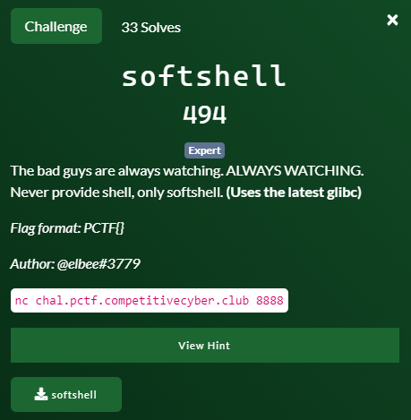
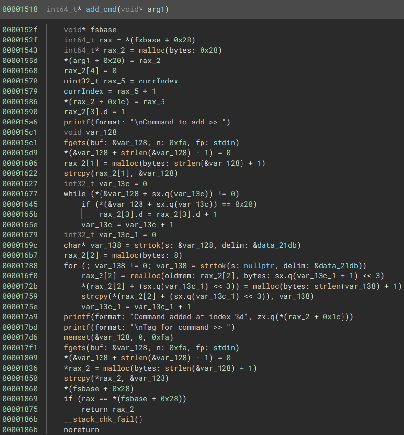
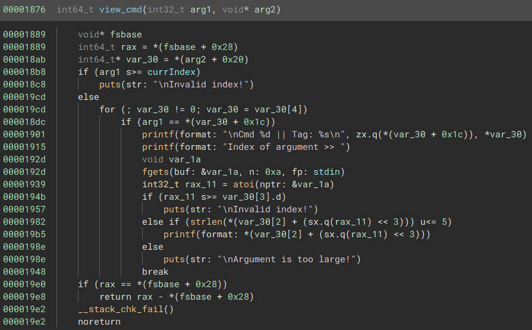
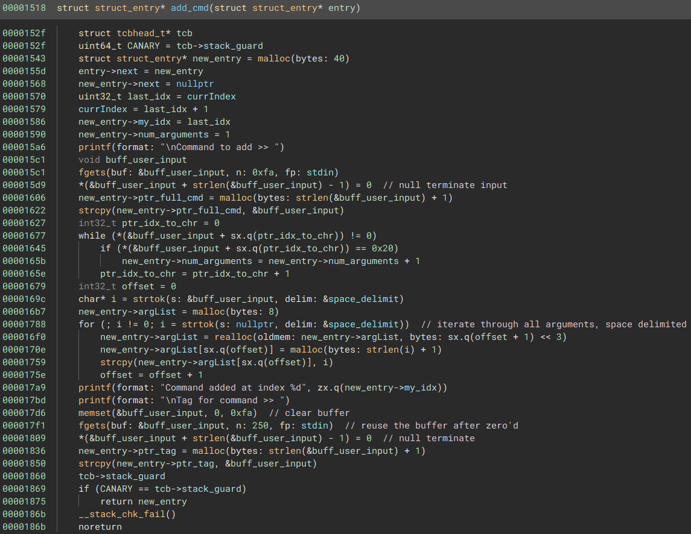
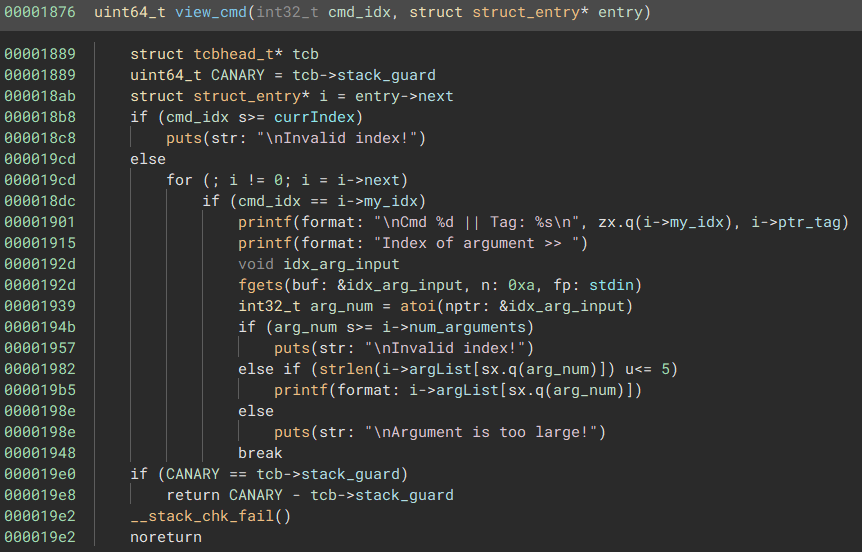

# Softshell



## Initial look

Just based on the menu system it looks like a `heap` challenge. 

The security measures:
```bash
[*] './softshell'
    Arch:     amd64-64-little
    RELRO:    Full RELRO
    Stack:    Canary found
    NX:       NX enabled
    PIE:      PIE enabled
```

So we have PIE binary, we're going to needs some leaks!

When we throw it into our disassembler we see that the binary is not striped but the code definitely isn't very clear to read. 




After playing with the inputs for a while, I focused on making sure I defined structure and understood the actual code. It turns out that the application uses a structure to store a command, and uses a singly linked list to store multiple commands.

When it comes down to it, this is what I interpreted the structure was:

```c
struct struct_entry __packed
{
    char* ptr_tag;
    char* ptr_full_cmd;
    char** argList;
    int32_t num_arguments;
    uint32_t my_idx;
    struct struct_entry* next;
};
```

When we assign names to variables, things get cleaned up fairly well.



## Vulnerability #1
The first vulnerability that I found was the ability to increment the number of arguments without actually mallocing space for that argument.

```c
// iterate through all arguments, space delimited
for (; i != 0; i = strtok(s: nullptr, delim: &space_delimit))  
    new_entry->argList = realloc(new_entry->argList, sx.q(offset + 1) << 3)
    new_entry->argList[sx.q(offset)] = malloc(strlen(i) + 1)
    strcpy(new_entry->argList[sx.q(offset)], i)
    offset = offset + 1
```

So when a command is provided that contains a number of sequential spaces, it will increment the counter but not actually insert the entry. This allows us to point into the next structure that is adjacent. Via the menu we can then free a pointer and then use a use after free to manipulate it.

```
 ┌───────────────────┐
 │                   │
 ├───────────────────┤
 │    entry_1        │
 ├───────────────────┤
 │  *tag             │
 │  *full_cmd        │
 │  char** arg_list  ├──────┐
 │  num_args         │      │
 │  my_idx           │      │
 │  next             │      │
 │                   │      │
 │                   │      │
 │                   │      │
 ├───────────────────┤      │
 │ arg_list[]◄───────┼──────┘
 │ arg1              │
 │ arg2              │
 │                   │
 ├───────────────────┤
 │    entry_2        │
 ├───────────────────┤
 │  *tag             │
 │  *full_cmd        │
 │  char** arg_list  │
 │  num_args         │
 │  my_idx           │
 │  next   ◄─────────┼───── Need to free this
 │                   │
 │                   │
 ...
 ├───────────────────┤
 │    entry_3        │
 ├───────────────────┤
 │  *tag             │
 │  *full_cmd        │
 │  char** arg_list  │
 │  num_args         │
 │  my_idx           │
 │  next             |
 │                   │
 │                   │
 └───────────────────┘
```

So our first step is placing enough spaces in the command that goes to `entry_1` to reach into `entry_2` so that we can free the pointer to `entry_3` by using the `5) Remove argument` in the menu on `entry_2`. At that point it will be placed on in the tcache.

This is where I struggled a bit because I didn't have a leak. What I played around with was creating a `tag` that was `0x28` bytes (the same size as the structure), freeing the `entry2->tag` pointer, and then allocing a new cmd. That would then allow me to leak that pointer. This still only gave me a heap pointer though...

### Wrong path

I was going to go down the path of allocing and freeing enough chunks to for a memory consolidation and forcing a chunk to be placed into the `unsorted bin`, thereby having a pointer to libc to leak. This would mean I'd have to try to pivot from there to leak the application base. But I have a tendency to overthink things, and figured I was missing something.

So back to the source!

## Vulnerability #2

The next vuln I spotted was a format string bug...:
```
    if (arg_num s>= i->num_arguments)
        puts(str: "\nInvalid index!")
    else if (strlen(i->argList[sx.q(arg_num)]) u<= 5)
        printf(format: i->argList[sx.q(arg_num)])  //<-------vuln
    else
        puts(str: "\nArgument is too large!")
    break
```
The code that prints out arguments via the `View command` will not print an argument that is larger than 4 characters. This was a problem initially because i could only leak 4 bytes at a time, but I had missed that there was a `Format String Bug`. So I create a command with several arguments like this: 

```
cmd %3$p %4$p %5$p %6$p %7$p %8$p %9$p %10$p 
```
This allowed me to print items/pointers off the stack and leak both heap and base address locations. I leaked the heap because I initially thought the solution would involve replacing the tcache pointer to arbitrary memory, and circumventing the ptmalloc security checks. But the solution ended up being much easier than that.

## Putting it all together

Using the leaked information about the base of the application, we can calculate the exact address of the string that is used to determine whether the command is allowed to run or not.
```
0x4020 /usr/games/cowsay moooo
```

So by freeing the pointer to the next pointer in `entry_2`, we can then attempt to run a command, when that fails, we can leave feedback. This conveniently alloc's `0x28` bytes (the same size as the struct that was freed), and we get the pointer to `entry_3`. We can then overwrite the pointer to `entry_3->tag`.

After that is done, we can edit the tag of `entry_3` via the `3) Edit tag` option in the menu, and set the command to `/bin/sh`. 

Then all we have to do is add a command entry with `/bin/sh`, and then run it with `4) Run command`.

[Full exploit](./exploit.py)

## Summary

This turned out to be a very cool heap challenge that didn't require in-depth ptmalloc knowledge. I thoroughly enjoyed working through this challenge.