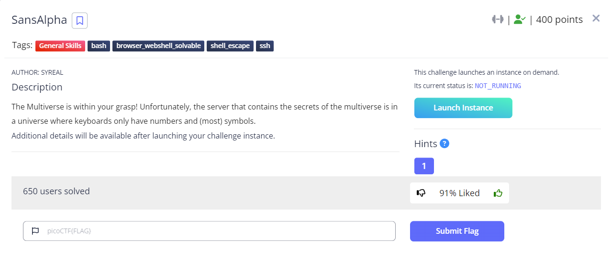

# SansAlpha



This challenge was really fun, I would say I enjoyed this challenge most this year.

We are given a terminal where we are able to type commands but we can only use numbers and (most)symbols.

We need to read the contents of the flag file in order to win. 

I did all of this challenge manually with notepad++ and copy pasting.

Here is the source for the challenge script. I went ahead and exfiltrated the script because I thought it would be fun to include in the writeup.

```python
#!/usr/bin/python3

from pwn import *
from time import sleep
import re

b = process(executable="/usr/bin/bash", argv=[], stdin=PTY)

while True:
  user_in = input("SansAlpha$ ")
  if user_in[-1] != "\n":
    user_in += "\n"
  alpha_filter_result = re.search("[a-zA-Z]", user_in)
  slash_filter_result = re.search("\\\\", user_in)
  if user_in == "exit\n":
    break
  if alpha_filter_result != None or slash_filter_result != None:
    print("SansAlpha: Unknown character detected")
    continue
  cmd = user_in.encode()
  b.send(cmd)
  sleep(0.5)
  o = b.recv(timeout=0.5)
  if o != b"":
    for line in o.decode().split('\n'):
      print(line)
```

Note, that obviously we weren't given this source, so we had to figure out what to do ourselves.

The gist of it is that we can save filled out globed data into variables, and then use those to cobble together strings to execute. 

I used the following:
```bash
__=(/???/???/?????)
___=(/???/????)
____=(/???/???/)
_____=(/???/??????????????????)
______=(/???/??????????????)
_______=(/???/???/?????????????/???????????????????????????????)
```
This sets up 6 environment variables.

I used the following as a decoder ring:
```bash
01234567890123
/etc/ssl/certs
/???/???/?????

01234567890123
/bin/arch
/???/????

01234567890123
/dev/pts/
/???/???/

012345678901234567890123
/bin/deb-systemd-helper
/???/??????????????????

012345678901234567890123
/bin/debconf-copydb
/???/??????????????

0123456789012345678901234567890123456789012345678901234
/etc/apt/trusted.gpg.d/ubuntu-keyring-2012-archive.gpg
/???/???/?????????????/???????????????????????????????
```

So if we want to type `cat` we can do that by doing:

```bash
${___:7:1}${___:5:1}${__:12:1}
```
To break this down further:

We use variable `___`
which is: `___=(/???/????)` or `/bin/arch`. It is indexed at zero. We get the `7`th character, for a length of `1`.
```bash
${___:7:1}
```

The commands I built up
```bash
cat
${___:7:1}${___:5:1}${__:12:1}

cd 
${___:7:1}${____:1:1}

ls
${__:7:1}${__:6:1}

r
${_____:22:1}

find
${______:11:1}${___:2:2}${______:5:1}

/ -

name
${______:10:1}${___:5:1}${_____:14:1}${_____:6:1}


type
${_____:12:1}${_____:10:1}${_____:20:2}


find / -type f
${______:11:1}${___:2:2}${______:5:1} / -${_____:12:1}${_____:10:1}${_____:20:2} ${______:11:1}

find / -name "fla*"
${______:11:1}${___:2:2}${______:5:1} / -${______:10:1}${___:5:1}${_____:14:1}${_____:6:1} "*${______:11:1}${__:7:1}${___:5:1}"

cat /etc/s*
${___:7:1}${___:5:1}${__:12:1} ${__:0:4}/${__:5:1}

ls -l /etc/*
${__:7:1}${__:6:1} -${__:7:1} ${__:0:4}/*

ls -l /home/*
${__:7:1}${__:6:1} -${__:7:1} /${_____:27:1}???/*
```

Ultimately the flag was in a subdirectory in the home directory. So just doing `cat */*` would get the flag, but I searched through the system for other things because it was fun at the time. 

All in all, I really enjoyed this challenge. There is a similar challenge on one of the wargame sites, where they add an additional hiderance, in that they also remove numbers. Maybe an idea for next year? ;) 

`picoCTF{7h15_mu171v3r53_15_m4dn355_145256ec}`