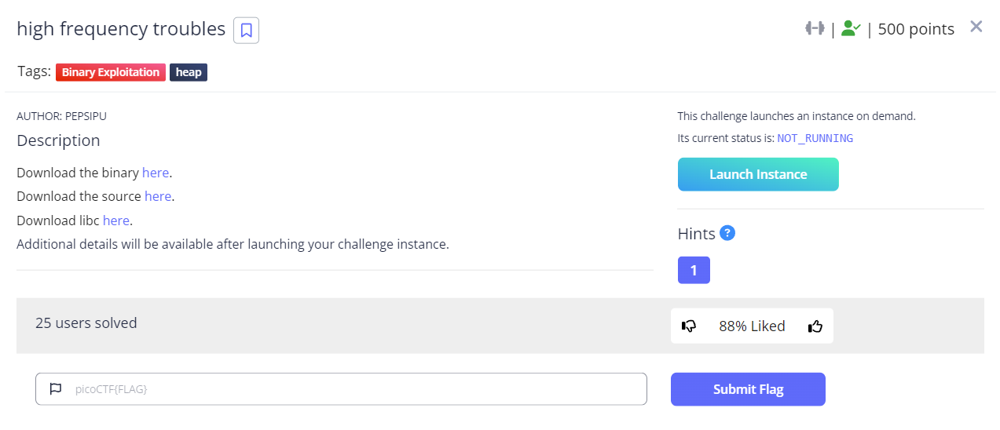

# High Frequency Toubles



Trouble indeed. This is going to be a long writeup.

## Shout out to the author

Thanks [`pepsipu`](https://pepsipu.com/) for putting together a well thought out challenge that wasn't something that participants could just look up in another write-up. Reading through all the `how2heap` techniques were of no help to me.

## Binary:

```bash
    Arch:     amd64-64-little
    RELRO:    Full RELRO
    Stack:    No canary found
    NX:       NX enabled
    PIE:      PIE enabled
    RUNPATH:  '.'
```

We are given the binary and the source code, here is a snippet:
```c
...
void putl(pkt_msg_t type, char *msg)
{
    printf("%s%s\x1b[m:[%s]\n", type_tbl[type].color, type_tbl[type].header, msg);
}

// gcc main.c -o hft -g
int main()
{
    setbuf(stdout, NULL);
    setbuf(stdin, NULL);

    putl(PKT_MSG_INFO, "BOOT_SQ");

    for (;;)
    {
        putl(PKT_MSG_INFO, "PKT_RES");

        size_t sz = 0;
        fread(&sz, sizeof(size_t), 1, stdin);

        pkt_t *pkt = malloc(sz);
        pkt->sz = sz;
        gets(&pkt->data);

        switch (pkt->data[0])
        {
        case PKT_OPT_PING:
            putl(PKT_MSG_DATA, "PONG_OK");
            break;
        case PKT_OPT_ECHO:
            putl(PKT_MSG_DATA, (char *)&pkt->data[1]);
            break;
        default:
            putl(PKT_MSG_INFO, "E_INVAL");
            break;
        }
    }

    putl(PKT_MSG_INFO, "BOOT_EQ");
}
```

All in all, a fairly simple binary, it's even compiled with `-g` so it's easier for us to debug, How nice... 

It's a `PIE` binary, and `FULL RELRO`. But we have the ability to alloc any size we want, and we have a `gets()`! So this should be pretty easy right? 

Here is a high level of things that this writeup covers.

- `libc_2.35`
- Thread Local Structure for libc
    - what is stored there and why it's useful
- Libc Global Offset Table
- One-Gadget to pop a shell
- ptmalloc heap behavior
- TCache implementation once again skirting all kinds of security measures
- `gets()` null termination getting in the way
- Not able to directly leak a heap, stack, executable, or libc address
- But still defeating 64bit ASLR.

I'd like to take a slightly different approach with this writeup. CTF problems are great learning tools because we have a puzzle to solve. Sometimes we can read other writeups and see what's applicable and apply it to our problem, and sometimes we just need to go through the discovery process ourselves.

I learned a lot with this challenge because of all the dead-ends I went down. I believe these can also be valuable to the reader. Even if they aren't directly applicable to the problem you're trying to solve, they might spark an idea of something you could try.

However, if you want to skip ahead to the reveal/summary, [Skip Ahead Here!](#breakthrough)

## Our troubles start!

Right off the bat, I started by executing the binary and reaching for `pwntools` to create a script to interface with this thing.

Heap challenges usually give you the ability to `malloc` and `free` frames. Here we are not given any such ability. In fact, we don't `free` a single frame during this whole journey.

| What I tried |
|---------------|
> One of the first things I did was overwrite the `top_chunk` on the heap to see what would happen. I tried creating fake chunks, thinking that maybe I could force `ptmalloc` to re-parse the chunks and consolidate them, and somehow populate a pointer to `main_arena` on the heap that I could leak.

| What I learned |
|----------------|
> Jumping the wilderness hasn't been a thing for a long time. `ptmalloc` has `main_arena` and `thread_arena` areas that maintain a pointer to the top chunk. There are several security checks in place to ensure we stay inside the heap bounds. Coalescing of chunks happens from the bins, which aren't populated in our case because we can't use `free`.


### Compiling LIBC from source with debug

Well that doesn't work at all. I wanted to understand more about `ptmalloc` and went down rabbit hole. Something that's really useful, is to compile your own `libc` with debug symbols:

```bash
git clone https://sourceware.org/git/glibc.git
cd glibc
git checkout glibc-2.35
mkdir build
cd build
../configure --prefix=/usr/local/glibc-2.35 CFLAGS="-g -O2 -ggdb3" CXXFLAGS="-g -O2 -ggdb3"
make -j$(nproc)
```

We get a nice HUGE binary with debug symbols and source code interlaced when we're debugging in GDB. This makes it much easier to trace through behavior.

### What happens when we allocate a LOT of data?

| Successful Attempt |
|--------------------|
> The next thing I wanted to see was what happens if we `malloc` a lot of data, and how does that behave on the heap.

| What I learned |
|----------------|
> By allocating more than `mp_.mmap_threshold` (`0x20000`) bytes, the implementation decides it needs to `mmap` memory to accommodate the request. Turns out where it allocates this memory is important to us.

#### Memory Map

I'd like to give an overview of the memory map of the process. Note that ASLR is disabled for the time being.

> **Note**: With ASLR enabled the base of `libc` will fall anywhere within a `1TB` memory range, and is unpredictable in order to thwart attacks such as the one we're about to attempt.

```bash
gef➤  vmmap 
[ Legend:  Code | Heap | Stack ]
Start              End                Offset             Perm Path
0x00555555554000 0x00555555555000 0x00000000000000 r-- /pwn/picoctf2024/pwn/high_frequency_troubles/hft
0x00555555555000 0x00555555556000 0x00000000001000 r-x /pwn/picoctf2024/pwn/high_frequency_troubles/hft
0x00555555556000 0x00555555557000 0x00000000002000 r-- /pwn/picoctf2024/pwn/high_frequency_troubles/hft
0x00555555557000 0x00555555558000 0x00000000002000 r-- /pwn/picoctf2024/pwn/high_frequency_troubles/hft
0x00555555558000 0x00555555559000 0x00000000003000 rw- /pwn/picoctf2024/pwn/high_frequency_troubles/hft
0x00555555559000 0x0055555555a000 0x00000000005000 rw- /pwn/picoctf2024/pwn/high_frequency_troubles/hft
0x007ffff7d90000 0x007ffff7d93000 0x00000000000000 rw- 
0x007ffff7d93000 0x007ffff7dbb000 0x00000000000000 r-- /pwn/picoctf2024/pwn/high_frequency_troubles/libc.so.6
0x007ffff7dbb000 0x007ffff7f50000 0x00000000028000 r-x /pwn/picoctf2024/pwn/high_frequency_troubles/libc.so.6
0x007ffff7f50000 0x007ffff7fa8000 0x000000001bd000 r-- /pwn/picoctf2024/pwn/high_frequency_troubles/libc.so.6
0x007ffff7fa8000 0x007ffff7fac000 0x00000000214000 r-- /pwn/picoctf2024/pwn/high_frequency_troubles/libc.so.6
0x007ffff7fac000 0x007ffff7fae000 0x00000000218000 rw- /pwn/picoctf2024/pwn/high_frequency_troubles/libc.so.6
0x007ffff7fae000 0x007ffff7fbd000 0x00000000000000 rw- 
0x007ffff7fbd000 0x007ffff7fc1000 0x00000000000000 r-- [vvar]
0x007ffff7fc1000 0x007ffff7fc3000 0x00000000000000 r-x [vdso]
0x007ffff7fc3000 0x007ffff7fc5000 0x00000000000000 r-- /usr/lib/x86_64-linux-gnu/ld-linux-x86-64.so.2
0x007ffff7fc5000 0x007ffff7fef000 0x00000000002000 r-x /usr/lib/x86_64-linux-gnu/ld-linux-x86-64.so.2
0x007ffff7fef000 0x007ffff7ffa000 0x0000000002c000 r-- /usr/lib/x86_64-linux-gnu/ld-linux-x86-64.so.2
0x007ffff7ffb000 0x007ffff7ffd000 0x00000000037000 r-- /usr/lib/x86_64-linux-gnu/ld-linux-x86-64.so.2
0x007ffff7ffd000 0x007ffff7fff000 0x00000000039000 rw- /usr/lib/x86_64-linux-gnu/ld-linux-x86-64.so.2
0x007ffffffde000 0x007ffffffff000 0x00000000000000 rw- [stack]
0xffffffffff600000 0xffffffffff601000 0x00000000000000 --x [vsyscall]
```

We see that there is this region of memory right before the `libc` library
```bash
0x007ffff7d90000 0x007ffff7d93000 0x00000000000000 rw- 
0x007ffff7d93000 0x007ffff7dbb000 0x00000000000000 r-- /pwn/picoctf2024/pwn/high_frequency_troubles/libc.so.6
```

| What I learned |
|----------------|
> `libc` will `mmap` space below this area `0x007ffff7d90000`, the memory will be contiguous... That means that our `gets()` overflow can write into this area... But what is this memory? This is the Thread Local Storage (`.tls`) section. And there are some interesting things stored here. 

But WHAT is stored here? If we take our custom compiled `libc` library we can dump the symbols that are stored there, and their offsets.

```bash
root@7e86e64a9ea1:/pwn/picoctf2024/pwn/high_frequency_troubles# objdump -t libc.so.6_mycompiled |grep tbss|sort
0000000000000010 g       .tbss  0000000000000004              errno
0000000000000010 l       .tbss  0000000000000004              __libc_errno
0000000000000018 l       .tbss  0000000000000008              __libc_tsd_CTYPE_TOLOWER
0000000000000020 l       .tbss  0000000000000008              __libc_tsd_CTYPE_TOUPPER
0000000000000028 l       .tbss  0000000000000008              __libc_tsd_CTYPE_B
0000000000000030 l       .tbss  0000000000000008              lm_cache
0000000000000038 l       .tbss  0000000000000008              tls_dtor_list
0000000000000040 g       .tbss  0000000000000008              __libc_dlerror_result
0000000000000048 l       .tbss  0000000000000008              tcache
0000000000000050 l       .tbss  0000000000000001              tcache_shutting_down
0000000000000058 l       .tbss  0000000000000008              thread_arena
0000000000000060 l       .tbss  0000000000000012              buffer
0000000000000074 g       .tbss  0000000000000004              __h_errno
0000000000000074 l       .tbss  0000000000000004              __libc_h_errno
0000000000000078 l       .tbss  0000000000000008              current
0000000000000080 l       .tbss  0000000000000008              thread_rpc_vars
0000000000000088 l       .tbss  0000000000000008              catch_hook
```

### Trying to leak an address.

We'll come back to these later. For now my thought was to try to leak an address in this area. 


| What I tried |
|---------------|
> A common technique is to write right up to a pointer with a string, and the print it out so that the address is leaked at the end of the string that is printed out. 

| What I learned |
|----------------|
> Turns out this isn't possible because `gets()` null terminates your input. `gets()` will always null terminate a provided buffer. There are notable exceptions, 1) if no characters were passed it will not write a null, 2) if EOF is received. Neither of these are helpful to us.

---

I spend a LOT of time stuck in this incorrect thought process, in these sort of challenges we usually leak an existing address somewhere.

| What I tried |
|---------------|
> What if I overwrite `tcache` in `.tls`... But I don't know any addresses of _anything_, so that's a dead end right? So what if I just overwrite the lowest byte with a null?

| What I learned |
|----------------|
> I learn where the real `tcache` is located. It's in the start of the heap memory, It's a `0x280` byte chunk that holds the `tcache` structure. It starts at heap+`0x10` bytes. By overwriting the lowest byte of the `tcache` pointer in `.tls` we shift things by `0x10` bytes. The `tcache` structure has an array of counts, and an array of pointers entries to the first chunks that are available. Which means if we try to allocate something from the right `tcache` bin, it will interpret the heap chunks metadata (`0x291`) as a counter. It will then look for a pointer to memory in that bin, which is zero, and try to allocate and dereference that, producing a segfault.

Well I can't see a way to make that work. What's next?

| What I tried |
|---------------|
> What if I set the `tcache` pointer in `.tls` to null? What happens then? 

| What I learned |
|----------------|
> Upon the next `malloc` attempt, the implementation will `mmap` a new area for `tcache` to be placed, it will use the `thread_arena` pointer in `.tls` to create this space and update the arena with this data. You get a new heap area. Fun, but not helpful.

---


| What I tried |
|---------------|
> What if I set `tcache` pointer to null, but overwrite the lowest byte of the `thread_arena` pointer, or for that matter can I write a value to the lowest byte, and overwrite the lowest `2` bytes? Goal here was to see if I could get `malloc` to eventually return something that already had data in it

| What I learned |
|----------------|
> There didn't seem to be a good offset I could write that would line up something that looked enough like a `tcache` struct. I very quickly scrapped this idea.

---

| What I tried |
|---------------|
> I noticed `tcache_shutting_down`. What happens if that is enabled?


| What I learned |
|----------------|
> This would essentially disable `tcache`, and go directly to allocating chunks from the `thread_arena`. This was useful when playing with the pointer to `thread_arena` without having a valid `tcache` pointer set. But ultimately not useful.

---

## Our Troubles continue

So what now? It's becoming more and more apparent that the `tcache` pointer was the path forward. But we don't know an address to write there! Don't we need to have a leak first?

While discussing the problem with a team member, inspiration hit! What if I set the address to a memory address I know will fall within the 1TB of memory `0x7f0000000000-0x7fffffffffff`. 

We can pick something in a lower section of the memory, and then `malloc` a ton of memory! But then what? We still don't have an address!
But if we populate the memory with our fake `tcache` structures, we can sneak in a counter.

As long as we maintain the counter, and place them at regular offsets, we can calculate where we started. A `tcache` struct looks like this:

```c
typedef struct tcache_entry
{
  struct tcache_entry *next;
  /* This field exists to detect double frees.  */
  uintptr_t key;
} tcache_entry;

typedef struct tcache_perthread_struct
{
  uint16_t counts[TCACHE_MAX_BINS];
  tcache_entry *entries[TCACHE_MAX_BINS];
} tcache_perthread_struct;
```

So we set up the `tcache` as follows, we populate the `count` array with 1's, and then populate the `entries` array with pointers to various things.

The main thing is that we need some small bins to point to the leak, so we can `malloc` a specific small size, and get back a pointer to our leak. We also need to set up a pointer so that we can `malloc` the start of our `tcache` structure again. We'll need to be able to modify the structure in order to do our arbitrary writes. `tcache` does have some security in that it encodes pointers in its linked list, but the pointers at the head of the list, in the `tcache` structure itself is not protected in the same way.

```
  ┌─────────────► ┌──────────────────────┐                     
  │               │  counts              │                     
  │               │                      │                     
  │               │                      │                     
  │               │                      │                     
  │               │                      │                     
  │               │                      │                     
  │               │                      │                     
  │               │                      │                     
  │               ├──────────────────────┤                     
  │               │  entries             │                     
  │               │   [0]                ├─────────────┐       
  │               │   [1]                │             │       
  └───────────────┤   [2]                │             │       
                  │   [.]                │             │       
                  |                      │             │       
                  │                      │             │       
                  │                      │             │       
                  │                      │             │       
                  │                      │             │       
                  │                      │             │       
                  ├──────────────────────┤             │       
                  │  LEAK:               │◄────────────┘       
                  │                      │                     
                  │                      │                     
                  │                      │                     
                  │                      │                     
                  │                      │                     
                  │                      │                     
                  │                      │                     
                  └──────────────────────┘                     
```
For the leak we can then format our size and `PKT_OPT_ECHO` command in a special way, so that it gets null terminated in the command portion and still prints out the data.

```python
payload = p64(20)          #Size
payload += b'\x01\x00\x00\x00\x00\x00\x00\x0a'
```

This will ensure that the pointer to `pkt->data[1]` will line up with the string we want to print.

At this point I made an decision: 
> *"I'll have to stack spray in a way that will land on this pointer... I'll figure that out later"*

## Assuming we can land into our fake `tcache` then what?

I turned off ASLR, and started figuring out how to proceed with my new read/write primitive.

- The thought process here is that you re-write the fake `tcache` structure, with pointers to memory you want to read/write. 
- You place that pointer in one of the `tcache` entries `bins`, of a specific size
- You then allocate memory of that size, and you get your pointer to that memory returned by `malloc`

This is exactly what happens and is super useful. Now what do we do with our new found power? Ultimately we need to get execution control. We need to figure out how to do that.

`libc_2.35` no longer has `__malloc_hook` which would have been useful. But reading up on things online, the libc `got` seemed like a good target.

---

| What I tried  |
|---------------|
> I located the `libc` `got` and replace all memory locations with invalid memory pointers. When these are used by the code, they produce a `segfault` that I can easily debug in `gdb`. I did this with `gdb` manually:
```python
python
for addr in range(0x00155555503000, 0x001555555031c8, 8):
    gdb.execute("set {{long}}{:#x} = {:#x}".format(addr, 0xCAE0000000000000 + (addr&0xFFFFFFFF)))
end
```

| What I learned |
|----------------|
> I found two locations that would be useful, `strchrnul` and `strlen`. I didn't seem to have control of what was passed to them, but my goal was to use them to trigger a jump to a `one_gadget` so they should suffice.

For those who aren't familiar with `one_gadgets`, these are locations in `libc` what will usually pop you a shell if you manage to jump to them. 

There are tools available to make finding them easier. For example here is one of them...
```c
0xebcf5 execve("/bin/sh", r10, rdx)
constraints:
  address rbp-0x78 is writable
  [r10] == NULL || r10 == NULL
  [rdx] == NULL || rdx == NULL
```

I was making mistakes at this point. I had worked a full day, and had been at it for a couple of hours after work, and was very tired. I checked all the `one_gadgets` that the tool gave me, and I believed that all failed to meet the constraints. This caused me to go through reading a bunch of other write-ups.

Listing some write-ups here:
- [binholic: notes-on-abusing-exit-handlers](https://binholic.blogspot.com/2017/05/notes-on-abusing-exit-handlers.html)
- [heap-2022](https://ctftime.org/writeup/34804)

The exit-handlers was a really interesting path to go down, and I want to try that at some point in the future. 

---

| What I tried  |
|---------------|
> Additionally I tried to leak a stack-pointer from `libc` memory, my thought here was that if I am able to write to the stack, I could turn this into a `rop` challenge. 


| What I learned |
|----------------|
> The locations in memory that I wanted to leak, I couldn't leak. A pointer in the `tcache` entries list needs to end in `zero`. I needed to align things very specifically in order to try to leak a pointer. And I didn't succeed in making that work (maybe because I was really tired).

At that point, I went to check on my kids and tell them to go to bed. My son took a look a me and said *"Dad, you look exhausted..."*. That was my cue to go take a shower and go to bed.

---

The next morning something was bugging me, and I decided to retest all of the `one-gadget`. Turns out that there was a successful gadget: `0xebcf5`. So with that problem solved we now just had to figure out the last problem. Heap-spray strategies!

I mean... I had "solved" the challenge right? I got execution control! But not on the remote server and I didn't get a `flag`... so NO solve yet. We can't give up!

---

| What I tried  |
|---------------|
> I ran the binary thousands of times, and recorded the base `libc` address. I then did a statistical analysis on it to if any addresses were more likely to be used.


| What I learned |
|----------------|
> Interestingly enough, of 65k runs, there were address ranges that appeared more frequently than others.

If we check a range of `0x10000000` bytes (`256MB`), we see certain address ranges are more common, but only slightly.
```
0005: 0x00007f1220000000 - 0x00007f122fffffff
0005: 0x00007f8060000000 - 0x00007f806fffffff
0005: 0x00007f8190000000 - 0x00007f819fffffff
0006: 0x00007f1660000000 - 0x00007f166fffffff
0006: 0x00007f2d20000000 - 0x00007f2d2fffffff
.
.
.
0029: 0x00007fbf80000000 - 0x00007fbf8fffffff
0029: 0x00007fc110000000 - 0x00007fc11fffffff
0029: 0x00007fc560000000 - 0x00007fc56fffffff
0029: 0x00007ffb10000000 - 0x00007ffb1fffffff
0030: 0x00007f6800000000 - 0x00007f680fffffff
```

----


| What I tried  |
|---------------|
> I wrote a script to emulated different strategies. If I allocate `0x21000` bytes but write one fake `tcache` structure (`~0x1000`), then it's a `1` in `33` chance to hit it, if I can pick a good pointer within that area (odds are not in our favor there). If I write more than one fake `tcache` structure to that area, then I use up time and I can't spray as much memory. I tried various different things to try to maximize the amount of space I write to, up also spray as many `tcache` structures as I can.


| What I learned |
|----------------|
> Allocating large chunks (several GB at a time), ensured that I more frequently hit allocated space. But getting it to line up with the `tcache` structures I was writing was just statistically not viable. It would take seconds/min to spray the stack. And if we get an instance where our `libc` base  was at `0x7fab....` and we've picked an address in the `0x7f80....` range, we just wasted all that time. 

| What I learned #2 |
|----------------|
> I also learned is that if you have allocated space with zeros, and your `tcache` pointer points to a bunch of zeros, the `tcache` logic will find nothing and then `ptmalloc` will give you a chunk of memory from the heap.🤔

I needed a better method. Back to reading and researching.

I stalked the author:
- [pepsipu](https://blog.pepsipu.com/)

I also started looking for other people who had encountered similar challenges:
- [how-to-bypass-aslr-on-linux-x86_64](https://github.com/nick0ve/how-to-bypass-aslr-on-linux-x86_64)

The problem was similar but not quite. He was able to read memory and determine whether the server memory was valid. Our server application instance lives and dies by our connection. So knowing information about one run isn't applicable to the next.

## Breakthrough

What we need to do is exit as soon as we know that we're in the wrong block of base memory. So what we can do is set our pointer to `tcache` to a static address, allocate a large chunk, for example `0x10000000` bytes, and then try to allocate a small chunk knowing that we haven't heap sprayed at all. One of multiple things could happen here

1) The memory is not valid, and we SEGFAULT
1) The memory is valid `rw-` memory, but contains data that causes a SEGFAULT
1) The memory is valid but is `r-x` memory, and causes a SEGFAULT
1) The memory is valid and contains zeros (likely our big chunk of memory we alloc'd) and we don't SEGFAULT

By pruning incorrect memory ranges early, we can very quickly iterate through instances for a memory region we can work with.
If we get an instance where we don't crash, we alloced the smallest possible chunk that will still get mmaped, which is below our large chunk, and then we spam as many fake `tcache` structures as we can before the server cuts us off... this turned out to be around the `0x7800000` bytes. What we're doing is overflowing our small chunk into the large adjacent memory. 

As soon as we've done that: 
- we try to allocate a small chunks again to see if we hit memory that we've now written to
- If we do, we can leak our counter, 
- we calculate our `libc_base`,
- we allocate a larger chunk that gives us a pointer back to our `tcache` memory
- we overwrite our `tcache` structure with updated pointer entries, specifically the pointer to `libc got`.
- we allocate a new chunk, and update the `libc got` entry to call our `one_gadget`
- we wait for that to trigger, and we pop a shell !!!

## How successful is this? 

It took me about an hour to get the flag from the server. I tried to get some statistics locally to get a better idea of how often it's successful.

I ran `4` concurrent instances of the exploit locally for ~`4 hours`, round about `100 000` iterations, the exploit landed `7` times. 

So that's a `0.007%` success rate. It's very very low, but enough to get us the flag!

